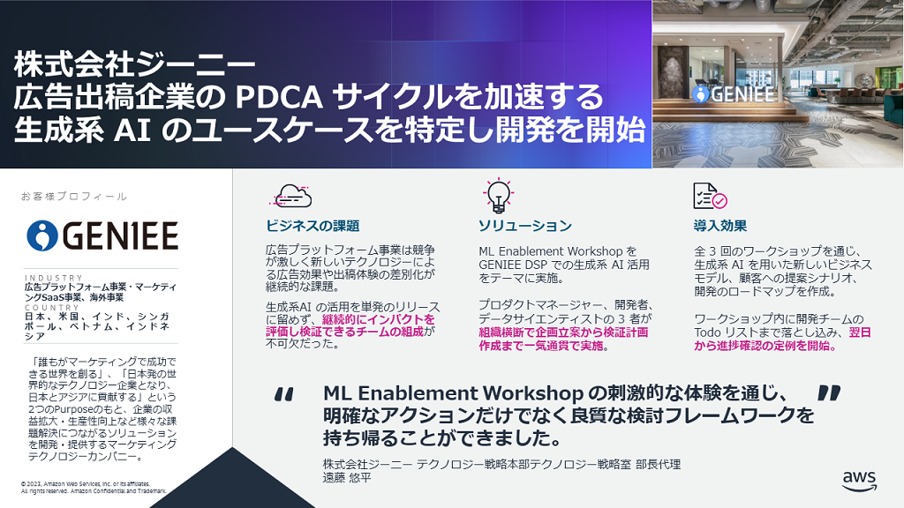

# ML Enablement Workshop

プロダクトマネージャーが、機械学習 / 生成系 AI によりプロダクトを継続的に成長させるロードマップが作れるワークショップです。

ワークショップの実施により、次のような課題の解決ができます。

* 機械学習や生成系 AI に可能性を感じるものの、技術に詳しくなく目の前の課題と結びつかない。
* データサイエンス・分析チームとは散発的なつながりしかなく、プロダクト全体への活用を議論できてない。
* 活用の機運が高まりアイデアが検討されるものの、いつの間にか立ち消えている。

上記の課題は、日本ではよく見られる課題です。例えば、日本ではデータを活用した企画や業務改善を主導できる人材が 20% 程度と米国の約 1/3 に留まり、 スタートアップでも技術革新を受けプロダクトのピボットを検討した企業は 1 割程度に留まります。この差が、 AI の導入効果が米国に比べ約 1/7 、スタートアップの成長率は約 1/30 と大きく乖離する一因になっています。関心ある方は以下の資料もご参照ください。

* [日本のAI導入効果がアメリカの7分の1程度しかないのはなぜなのか](https://note.com/piqcy/n/na971fee54568) : 📹[動画](https://www.youtube.com/watch?v=Uxip1ggPwtw)
* [日本のスタートアップ企業の成長速度が米国に比べ30分の1以下という現状にデータサイエンティストは何ができるか](https://note.com/piqcy/n/n66c93427d8f0)

本ワークショップではデータに基づく顧客体験の改善 (=成長サイクル) を 1~3 カ月で行う計画を作成します。ワークショップおよび計画の実行を通じて得られる共通体験から機械学習や生成系 AI の活用、データサイエンスチームとの連携を持続的にし米国同等の効果と成長率を実現します。

## :books: ワークショップ資料

ワークショップは 3 部構成となっています。 Title のリンクから各パートの詳細にアクセスできます。

| Title |[理解編: 成長サイクルの理解](docs/organizer/day1.md)|[応用編: 顧客体験改善への応用](docs/organizer/day2.md)|[開始編: 検証/実装を開始する](docs/organizer/day3.md)|
|:--------|:---------|:------|:------|
| Image ||||
| Work  | 事例に基づくビジネスモデル作成 | 顧客への提案シナリオ作成と反応の予測 | 1 ~3 カ月のマイルストン作成 |
| Time(*) | 3 時間 | 4 時間 | 3 時間 |

**理解編**で、プロダクトが機械学習で成長する仕組みを学び、事例を参考に自社のビジネスモデルを設計します。  
**応用編**で、顧客への提案シナリオを構築、シミュレーションし予測される反応を洗い出します。  
**開始編**で、ビジネス価値を着実に積みつつ検証を進めていくための段階的なステップを設計します。

(*) 1 時間のバッファ込みの時間です。

ML Enablement Workshop の特徴は 3 つです。

* 💪 **実践的**
   * AWS のノウハウが詰め込まれています。 AWS の事例、またワークショップの提供から得られた「活きた知見」が資料と提供者用ガイドに集約されています。
* 🛠️ **協調的**
   * AWS のサービスとプログラムでロードマップの実現を支援します。手軽に生成系 AI が使える [Amazon Bedrock](https://aws.amazon.com/jp/bedrock/) や無料で Jupyter Notebook が使える [Amazon SageMaker Studio Lab](https://studiolab.sagemaker.aws/) から、機械学習の継続的な学習に不可欠な MLOps を構築する [Amazon SageMaker](https://aws.amazon.com/jp/sagemaker/) まで、幅広なサービスと [生成系 AI イノベーションセンター](https://aws.amazon.com/jp/about-aws/whats-new/2023/06/aws-announces-generative-ai-innovation-center/) 等の実装支援プログラムでユースケースの実現まで伴走します。
* :octocat: **公共的**
   * GitHub で オープンソースとして教材を公開しており、ライセンスの範囲で無料で利用頂くことができます。[ワークショップを開催するためのガイド](docs/organizer/)を参照し、社内での機械学習やデータ活用推進などに活用いただけます。

「実践的」の証明としてワークショップ改善の歩みを残しています。関心ある方はご参照ください。

* [機械学習プロジェクトの約80%が失敗するのは伊達ではないと実感したが、現実に負けないワークショップに挑戦する](https://note.com/piqcy/n/n9c9e97896596)
   * ML Enablement Workshop 改善版について、改善前の課題と改善後のポイントをまとめた記事です。
* [機械学習モデル開発プロジェクトの体験ハンズオンを公開しました](https://note.com/piqcy/n/n51ffb8e02293)
   * 初版公開時の記事です。

### 📌 スペシャルコンテンツ

AWS だけでなく、 Amazon, Spotify, Uber など世界的なプロダクトのマネージャーがどのように機械学習を活用しているか調査し、その内容も反映しています。下記記事で、 Q&A 形式で機械学習を含むデータサイエンスの活用方法をまとめています。

**[データサイエンスを活用するプロダクトマネージャーを訪ねて](docs/journal/README.md)**

### 🤖 生成系 AI への適用

生成系 AI の活用とそれを推進する ML Enablement Workshop について発表した資料です。

* [大規模言語モデルを Fine Tuning すべきタイミングとその方法](https://speakerdeck.com/icoxfog417/da-gui-mo-yan-yu-moderuwo-fine-tuning-subekitaimingutosonofang-fa)
   * プロダクトを生成系 AI で成長させるのになぜ Fine Tuning が必要なのか、どのような手順で進めればよいのかを解説したスライドです。Biz 、Dev 、 ML の 3 ステップのプロセスを紹介し Biz フェーズの支援として ML Enablement Workshop を紹介しています。
* [ゲーム業界における生成系AIの活用](https://speakerdeck.com/icoxfog417/gemuye-jie-niokerusheng-cheng-xi-ainohuo-yong)
   * ゲーム業界で生成系 AI を活用している事例と、活用のためのポイントをまとめた発表した記事です。
* [プロダクトの成長をリードする生成系 AI の活用戦略](https://speakerdeck.com/icoxfog417/purodakutonocheng-chang-woridosurusheng-cheng-xi-ai-nohuo-yong-zhan-lue)
   * 短期的な生成系 AI のお試しから、長期的なプロダクトの差別化につなげる戦略の立て方を解説した資料です。Biz 、Dev 、 ML の 3 ステップについて、 生成系 AI の活用事例をベースにポイントを解説しています。

## :rocket: 短期集中型ワークショップ

特定目的にフォーカスし ML Enablement Workshop 本体より短時間で学びを得るワークショップ / ハンズオンのコンテンツです。

* [プロダクトを成長させる生成系 AI のユースケースを考えるワークショップ](https://speakerdeck.com/icoxfog417/purodakutowocheng-chang-saserusheng-cheng-xi-ai-noyusukesuwokao-eruwakusiyotupu) ( 所要時間 1 時間半 ~ 2 時間 )
   * プロダクトで生成系 AI を活用するためのアイデアを発想、検証するためのワークショップです。1) 生成系 AI 活用のポイント、 2) アイディエーション、 3) ビジネスモデルキャンバスを利用したアイデアの効果検証、の 3 パートから成ります。 3 パートのどの段階まで行くかは、 Easy / Normal / Hard の 3 段階から選べるようになっています。
* [サービスの解約率改善シナリオ](./notebooks/scenario_churn/) ( 所要時間 2~3 時間 )
   * 携帯電話会社での解約率改善を題材に、ビジネス理解からモデルのテストまで一気通貫で体験できるハンズオン。

## ⚡ ハンズオン資料

開発者向けの機械学習ハンズオン資料です。
目次のNo.1から順に進めていくことで各開発プロセスでなにを行うのか、なぜ行うのか、どう行うのかを学ぶことができます。ハンズオンは Amazon SageMaker Studio Lab を使用し進めます。アカウントの作成方法や使い方は[Amazon SageMaker Studio Lab の使い方](https://github.com/aws-sagemaker-jp/awesome-studio-lab-jp/blob/main/README_usage.md)を参照してください。

|No   |Process|Title|Content|Video|
|:----|:------|:----|:----|:----|
|1    |Introduction|機械学習モデル開発プロジェクトの進め方|||
|2    |Environment Setup|機械学習モデルの開発環境を構築する|||
|3    |Business Understanding|機械学習の価値を計算する|||
|4    |Analyze|データから価値を創出できるか診断する|||
|5    |Prepare|診断結果に基づきデータを充足する|||
|6    |Preprocess|機械学習モデルが認識しやすいデータにする||  |
|7    |Train|機械学習モデルを学習する|||
|8    |Test|機械学習モデルを評価する||(Comming Soon)|
|9    |Ending|機械学習モデルの開発から運用へ||(Comming Soon)|

## 活用事例

### [株式会社マネーフォワード](https://corp.moneyforward.com/)

**[ユーザに最高の付加価値を提供するための AI 活用に向けて](https://pages.awscloud.com/APAC_FIELD_T2_jp-isv-saas-on-aws-2022-archives-reg.html)** (@ [SaaS on AWS 2022](https://pages.awscloud.com/APAC_FIELD_T2_jp-isv-saas-on-aws-2022-day1-inperson-reg.html))  
マネーフォワードでは 「Money Forwardクラウド」 の中長期の重要テーマとしてバックオフィス業務の自動・自律化を目指す 「Autonomous Backoffice」 を標榜し、AI 活用の取組みを進めています。推進するうえでの課題や課題に対する取組み、今後の展望についてお伝えするとともに、AI ユースケース創出のための取組みとして、AWS 支援による PdM を対象としたワークショップについてもご紹介します。|

### [株式会社ジーニー](https://geniee.co.jp/)

競争の激しい広告プラットフォーム事業で、継続的にインパクトのあるユースケースを生み出せるチームを組成するために ML Enablement Workshop を活用。組織横断で企画立案から検証計画まで一気通貫で作成し、ワークショップ終了翌日から進捗確認の定例を開始する迅速な立ち上がりを実現。

**様々なお客様のプロダクトチームで、ワークショップをご活用頂いています**

活用頂いた事例を掲載頂ける場合は、[Issue](https://github.com/aws-samples/aws-ml-enablement-handson/issues/new?assignees=&labels=enhancement&template=case-study.md&title=)よりご連絡ください。

## 開催者向けガイド

ML Enablement Workshopの教材を利用して、社内でワークショップを開催頂くことができます。

[開催者向けガイド](docs/organizer)

* [ライセンス](LICENSE)に従い、著作権者であるAWSを明記を頂くと共に著作権法に定める引用の要件を満たすようご利用ください。
* AWS以外の個人や法人が「ML Enablement Workshop」の名称もしくは同一とみなされる名称でワークショップを開催することを禁止します。お客様の混乱を防ぐための措置で、ご理解をお願い致します。

## 改善要望

ハンズオンコンテンツについてのご要望や質問を歓迎します！事前に [CONTRIBUTING](CONTRIBUTING.md#security-issue-notifications)に目を通して頂ければ幸いです。

* [ご要望/不具合報告へのリンク (Issue) ](https://github.com/aws-samples/aws-ml-enablement-workshop/issues/new/choose)
* [コンテンツ/不具合の改善送付 (Pull Request)](https://github.com/aws-samples/aws-ml-enablement-workshop/compare)
* ご質問: [GitHub Discussion](https://github.com/aws-samples/aws-ml-enablement-handson/discussions)
* セキュリティに関するご連絡: [CONTRIBUTING](CONTRIBUTING.md#security-issue-notifications)

## ライセンス

[MIT-0 License](LICENSE)
