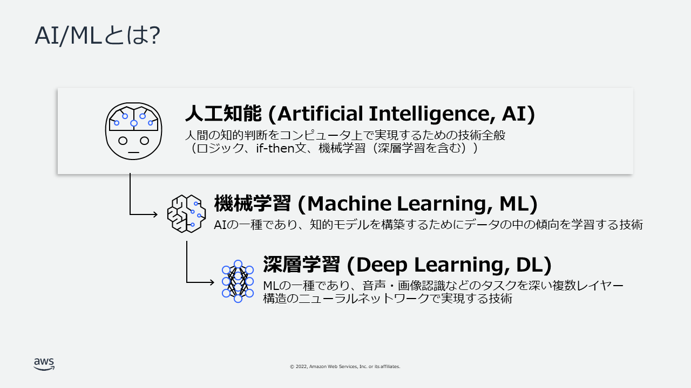
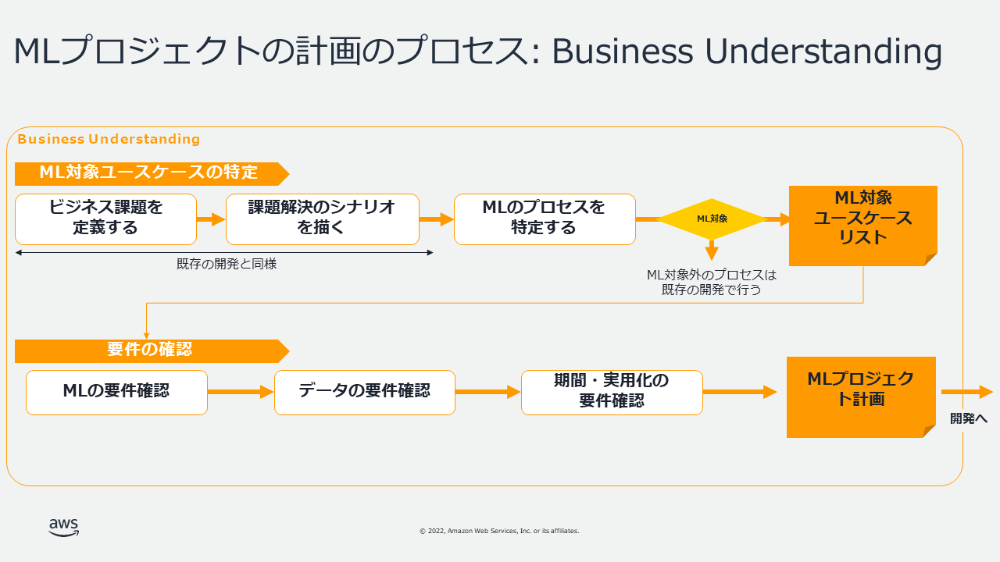
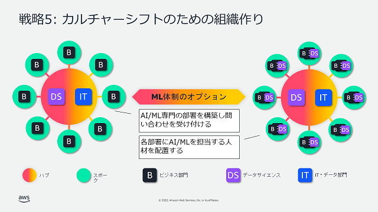
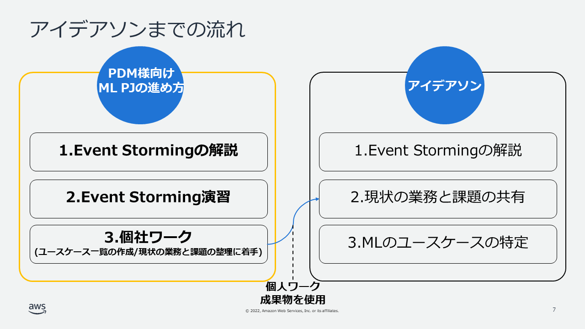
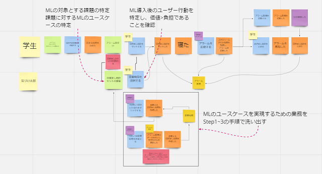
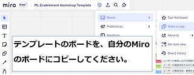
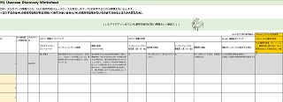
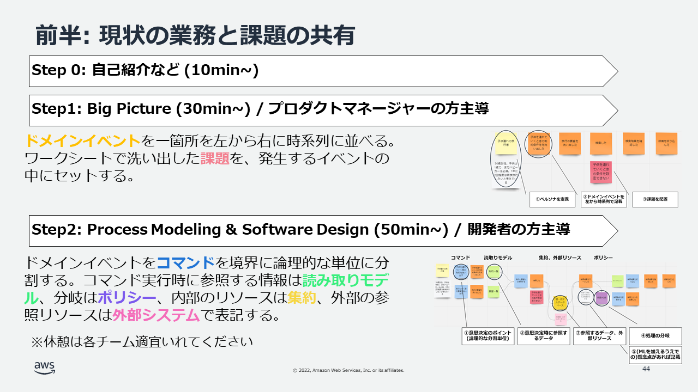
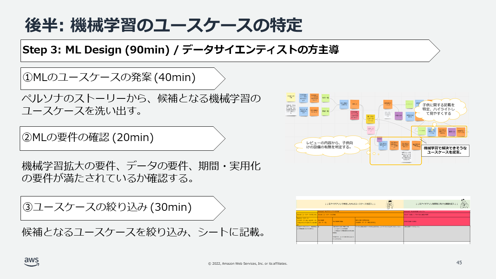
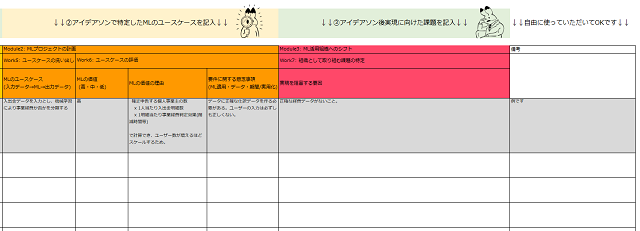

# ML Enablement Workshop

プロダクトを開発するチームが、**課題解決の選択肢として機械学習を選択できるようになること**をゴールとしたワークショップです。ワークショップは3部構成となっています。

1. 機械学習インプット(プロダクトマネージャ向け)
2. ハンズオン(開発者向け)
3. アイデアソン

3部構成のコンテンツは、機械学習プロジェクトをはじめるときに直面する3つの課題をそれぞれ解決するために作成されています。

🌧️ **Machine Learning Project Problems**
1. プロダクトマネージャーが機械学習を十分理解しておらず、機械学習を用いたプロダクト機能を発案できない。
2. 開発エンジニアに機械学習の知見がなく、研究開発部門から手取り足取りの支援が必要。
3. 研究開発部門がユーザー課題を認識できておらず、機械学習活用の適切な提案ができない。

**実践的**、**わかりやすい**、**無料**であることがコンテンツの特徴です。

* :dart: **実践的**
   * 機械学習インプット、ハンズオンではビジネスゴールの設定方法から解説([Business Understanding](https://youtu.be/csiMBxUkAEc))。
   * ハンズオンでは他のロールとコミュニケーションをとるための演習を実施。
   * アイデアソンではプロダクトマネージャー、開発者、データサイエンティスト全員が集まりユーザーの業務、課題を深掘り。
* :bulb: **わかりやすい**
   * 機械学習インプットは開発の知識を要求しない内容で解説。
   * ハンズオンでは、なにをするのか、なぜするのか、どうおこなうのか、順を追って工程の必然性を解説。YouTube動画で好きな時に学習可能(例: [機械学習の価値を計算する](https://youtu.be/csiMBxUkAEc))。
   * ハンズオンでは、インタラクティブなJupyter Notebookでデータの分析からテストまで各工程で必要となるPythonの基本的な実装を学習可能(例: [Analyze](https://studiolab.sagemaker.aws/import/github/aws-samples/aws-ml-enablement-handson/blob/main/notebooks/02_analyze.ipynb), [Preprocess](https://studiolab.sagemaker.aws/import/github/aws-samples/aws-ml-enablement-handson/blob/main/notebooks/04_preprocess.ipynb))。
* :octocat: **無料**
   * GitHubでOSSとして教材を公開。
   * ハンズオンに使用する[SageMaker Studio Lab](https://studiolab.sagemaker.aws/)も無料で利用が可能。
   * ライセンスの範囲でForkし編集して利用が可能。

## Day1: 機械学習インプット

プロダクトマネージャーの方に機械学習を理解いただくため、機械学習の入門、プロジェクト計画、機械学習を活用できる組織へのシフト方法の3つを解説します。

|No   |Title|Content| Video |
|:----|:----|:----|:----|
|1    |MLの入門| [機械学習の仕組み、事例、制約などを解説 ](docs/presentations/ml-enablement-workshop-module1.pdf)  |  |
|2    |MLプロジェクトの計画 | [ユースケースの発見方法と要件の確認方法を解説 ](docs/presentations/ml-enablement-workshop-module2.pdf)|  |
|3    | ML活用組織へのシフト|[機械学習を推進するための組織戦略を解説 ](docs/presentations/ml-enablement-workshop-module3.pdf) |  |

プロダクトマネージャーの方は、アイデアソンでユーザーの業務と課題を開発者とデータサイエンティストにEvent Stormingで効果的に伝えて頂きます。当日ファシリテートができるよう、Event Stormingについて解説します。

|No   |Title|Content| Video |
|:----|:----|:----|:----|
|4    |アイデアソン解説(Day1用)| [アイデアソンで使用するEvent Stormingを解説 ](docs/presentations/ml-enablement-workshop-ideathon-day1.pdf)  |  |
|5    |Event Storming演習 | [目覚まし時計の例でEvent Stormingを実践 ](https://miro.com/app/board/uXjVOq7OXDo=/?share_link_id=645601919622)  |  |
|6    |ユースケースリスト化 | [ML Usecase Discovery Worksheetでユースケースを洗い出す ](docs/presentations/ML_Usecase_Discovery_Worksheet.xlsx) |  |

## Day2: ハンズオン

開発者向けの機械学習ハンズオン資料です。
目次のNo.1から順に進めていくことで各開発プロセスでなにを行うのか、なぜ行うのか、どう行うのかを学ぶことができます。

|No   |Process|Title|Content|Video|
|:----|:------|:----|:----|:----|
|1    |Introduction|機械学習モデル開発プロジェクトの進め方|||
|2    |Environment Setup|機械学習モデルの開発環境を構築する|||
|3    |Business Understanding|機械学習の価値を計算する|||
|4    |Analyze|データから価値を創出できるか診断する|||
|5    |Prepare|診断結果に基づきデータを充足する|||
|6    |Preprocess|機械学習モデルが認識しやすいデータにする||  |
|7    |Train|機械学習モデルを学習する||(Comming Soon)|
|8    |Test|機械学習モデルを評価する||(Comming Soon)|
|9    |Ending|機械学習モデルの開発から運用へ||(Comming Soon)|

### ビジネス課題別シナリオ

実践的なビジネス課題を題材に機械学習モデル開発プロジェクトの進め方を体験できます。

* [サービスの解約率改善シナリオ](notebooks/scenario_churn)

## アイデアソン

プロダクトマネージャー、開発者、データサイエンティストの3者でユーザーの業務と課題を理解し、機械学習のユースケースを発見するアイデアソンを実施するための資料です。

|No   |Title|Content|
|:----|:----|:----|
|1    | Event Storming準備 | [アイデアソンで使用するEvent Stormingのボードを準備します(※リンク先のボードをコピーして使用してください) ](https://miro.com/app/board/uXjVOq7OXDo=/?share_link_id=645601919622)  |
|2    |アイデアソン: 前半| [アイデアソンの進め方を解説し、現状のユーザーの業務、課題、プロダクトのアプローチを整理 ](docs/presentations/ml-enablement-workshop-ideathon-day3.pdf)  |
|3    |アイデアソン: 後半| [機械学習が有効なユースケースの特定とアプローチ方法の定義 ](docs/presentations/ml-enablement-workshop-ideathon-day3.pdf)  |
|4    |ユースケース評価 | [ユースケースに、Event Stormingで検証した価値、また実現のための課題を反映します。](docs/presentations/ML_Usecase_Discovery_Worksheet.xlsx) |

## 活用事例

* [Money Forward](https://moneyforward.com/). **[ユーザに最高の付加価値を提供するための AI 活用に向けて](https://pages.awscloud.com/APAC_FIELD_T2_jp-isv-saas-on-aws-2022-archives-reg.html)**. [SaaS on AWS 2022](https://pages.awscloud.com/APAC_FIELD_T2_jp-isv-saas-on-aws-2022-day1-inperson-reg.html).
   * マネーフォワードでは 「Money Forwardクラウド」 の中長期の重要テーマとしてバックオフィス業務の自動・自律化を目指す 「Autonomous Backoffice」 を標榜し、AI 活用の取組みを進めています。推進するうえでの課題や課題に対する取組み、今後の展望についてお伝えするとともに、AI ユースケース創出のための取組みとして、AWS 支援による PdM を対象としたワークショップについてもご紹介します。

活用頂いた事例を掲載頂ける場合は、[Issue](https://github.com/aws-samples/aws-ml-enablement-handson/issues/new?assignees=&labels=enhancement&template=case-study.md&title=)よりご連絡ください。

## Contribution

ハンズオンコンテンツについてのご要望や質問を歓迎します！事前に [CONTRIBUTING](CONTRIBUTING.md#security-issue-notifications)に目を通して頂ければ幸いです。

* ご要望/不具合: [GitHub Issue](https://github.com/aws-samples/aws-ml-enablement-handson/issues)
* ご質問: [GitHub Discussion](https://github.com/aws-samples/aws-ml-enablement-handson/discussions)
* セキュリティに関するご連絡: [CONTRIBUTING](CONTRIBUTING.md#security-issue-notifications)

## LICENSE

[MIT-0 License](LICENSE)
