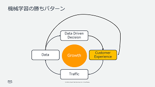
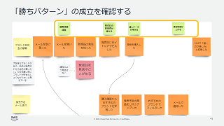
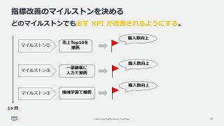

# ML Enablement Workshop

プロダクトマネージャーが、機械学習の「勝ちパターン」を実現するチームとロードマップが作れるワークショップです。

## :books: ワークショップ資料

ワークショップは3部構成となっています。Titleのリンクから資料へ、Workから成果物用のテンプレートにアクセスできます。

| Title |[理解編: ベストプラクティスの理解](docs/presentations/ml-enablement-01-architect.pdf)|[応用編: 顧客体験改善への応用](docs/presentations/ml-enablement-02-application.pdf)|[開始編: 顧客体験の改善を開始する](docs/presentations/ml-enablement-03-action.pdf)|
|:--------|:---------|:------|:------|
| Image ||||
| Work  | [ベストプラクティス一覧](https://docs.google.com/spreadsheets/d/1lJmDi1Fx50HzEWXq8YU--I1HOdFIEcN7YJVAsMlAtQI/edit?usp=sharing) | [Event Storming用ボード](https://miro.com/app/board/uXjVMSMR38c=/?share_link_id=286437223244) |Coming Soon|
| Video | Coming Soon|Coming Soon|Coming Soon|

**理解編**で、機械学習の「勝ちパターン」と勝ちパターンを成立させたベストプラクティス事例を学びます。**応用編**で、事例を下地にプロダクトの顧客体験が改善するプロセスを可視化します。**開始編**で、勝ちパターン成立に向け効果を確認しながら投資とチームを拡大できるよう、段階的なステップを設計します。

ML Enablement Workshopを利用いただくメリットは3つです。

* 💪 **実践的**
   * AWSで機械学習の活用を支援したノウハウが詰め込まれています。ワークショップの提供から得られたつまづきや成功の知見、お客様からのフィードバックを随時反映し「活きた知見」を提供します。
* 🛠️ **実現性**
   * AWSのサービスとプログラムでロードマップの実現を支援します。無料で利用可能な[Amazon SageMaker Studio Lab](https://studiolab.sagemaker.aws/)や表計算ソフト間隔で使える[Amazon SageMaker Canvas](https://aws.amazon.com/jp/sagemaker/canvas)など、熟練したデータサイエンティストがいなくても機械学習が実装できるサービスを提供しています。AWSのエキスパートによるモデル構築支援を行う[ML Solutions Lab](https://aws.amazon.com/jp/ml-solutions-lab/)等も含め、サービスとプログラム両面で機械学習による勝ちパターンの実現を支援します。
* :octocat: **無料**
   * GitHubでOSSとして教材を公開しており、ライセンスの範囲で自由に利用頂くことができます。[ワークショップを開催するためのガイド](https://github.com/aws-samples/aws-ml-enablement-workshop#%E9%96%8B%E5%82%AC%E8%80%85%E5%90%91%E3%81%91%E3%82%AC%E3%82%A4%E3%83%89)も提供し、社内でのデータ活用推進などに活かしていただきます。

## 🔍 関連資料

* [ゲーム業界における生成系AIの活用](https://speakerdeck.com/icoxfog417/gemuye-jie-niokerusheng-cheng-xi-ainohuo-yong)
   * ゲーム業界で生成系 AI を活用している事例と、活用のためのポイントをまとめた発表した記事です。
* [プロダクトの成長をリードする生成系 AI の活用戦略](https://speakerdeck.com/icoxfog417/purodakutonocheng-chang-woridosurusheng-cheng-xi-ai-nohuo-yong-zhan-lue)
   * 短期的な生成系 AI のお試しから、長期的なプロダクトの差別化につなげる戦略の立て方を解説した資料です。Biz 、Dev 、 ML の 3 ステップについて、 生成系 AI の活用事例をベースにポイントを解説しています。
* [機械学習プロジェクトの約80%が失敗するのは伊達ではないと実感したが、現実に負けないワークショップに挑戦する](https://note.com/piqcy/n/n9c9e97896596)
   * ML Enablement Workshop 改善版について、改善前の課題と改善後のポイントをまとめた記事です。
* [日本のAI導入効果がアメリカの7分の1程度しかないのはなぜなのか](https://note.com/piqcy/n/na971fee54568)
   * AI白書2022を元にした調査記事
* [機械学習モデル開発プロジェクトの体験ハンズオンを公開しました](https://note.com/piqcy/n/n51ffb8e02293)
   * 初版公開時の記事

#### 📌 スペシャルコンテンツ

Amazon, Spotify, Uber など世界的なプロダクトのマネージャーがどのように機械学習を活用しているか Q&A 形式でまとめた記事。

* [データサイエンスを活用するプロダクトマネージャーを訪ねて](docs/journal/README.md)

## :rocket: 短期集中型ワークショップ

特定目的にフォーカスし ML Enablement Workshop 本体より短時間で学びを得るワークショップ / ハンズオンのコンテンツです。

* [プロダクトへの生成系 AI 活用方法をアイディエーションする会](https://speakerdeck.com/icoxfog417/purodakutohenosheng-cheng-xi-ai-huo-yong-fang-fa-wo-aideiesiyonsuruhui) ( 所要時間 1 時間半 ~ 2 時間 )
   * プロダクトで生成系 AI を活用するためのアイデアを発想、検証するためのワークショップです。1) 生成系 AI 活用のポイント、 2) アイディエーション、 3) ビジネスモデルキャンバスを利用したアイデアの効果検証、の 3 パートから成ります。
* [サービスの解約率改善シナリオ](./notebooks/scenario_churn/) ( 所要時間 2~3 時間 )
   * 携帯電話会社での解約率改善を題材に、ビジネス理解からモデルのテストまで一気通貫で体験できるハンズオン。

## ⚡ ハンズオン資料

開発者向けの機械学習ハンズオン資料です。
目次のNo.1から順に進めていくことで各開発プロセスでなにを行うのか、なぜ行うのか、どう行うのかを学ぶことができます。ハンズオンは Amazon SageMaker Studio Lab を使用し進めます。アカウントの作成方法や使い方は[Amazon SageMaker Studio Lab の使い方](https://github.com/aws-sagemaker-jp/awesome-studio-lab-jp/blob/main/README_usage.md)を参照してください。

|No   |Process|Title|Content|Video|
|:----|:------|:----|:----|:----|
|1    |Introduction|機械学習モデル開発プロジェクトの進め方|||
|2    |Environment Setup|機械学習モデルの開発環境を構築する|||
|3    |Business Understanding|機械学習の価値を計算する|||
|4    |Analyze|データから価値を創出できるか診断する|||
|5    |Prepare|診断結果に基づきデータを充足する|||
|6    |Preprocess|機械学習モデルが認識しやすいデータにする||  |
|7    |Train|機械学習モデルを学習する|||
|8    |Test|機械学習モデルを評価する||(Comming Soon)|
|9    |Ending|機械学習モデルの開発から運用へ||(Comming Soon)|

## 活用事例

* [Money Forward](https://moneyforward.com/). **[ユーザに最高の付加価値を提供するための AI 活用に向けて](https://pages.awscloud.com/APAC_FIELD_T2_jp-isv-saas-on-aws-2022-archives-reg.html)**. [SaaS on AWS 2022](https://pages.awscloud.com/APAC_FIELD_T2_jp-isv-saas-on-aws-2022-day1-inperson-reg.html).
   * マネーフォワードでは 「Money Forwardクラウド」 の中長期の重要テーマとしてバックオフィス業務の自動・自律化を目指す 「Autonomous Backoffice」 を標榜し、AI 活用の取組みを進めています。推進するうえでの課題や課題に対する取組み、今後の展望についてお伝えするとともに、AI ユースケース創出のための取組みとして、AWS 支援による PdM を対象としたワークショップについてもご紹介します。

**様々なお客様のプロダクトチームで、ワークショップをご活用頂いています**

活用頂いた事例を掲載頂ける場合は、[Issue](https://github.com/aws-samples/aws-ml-enablement-handson/issues/new?assignees=&labels=enhancement&template=case-study.md&title=)よりご連絡ください。

## 開催者向けガイド

ML Enablement Workshopの教材を利用して、社内でワークショップを開催頂くことができます。

[開催者向けガイド](docs/organizer)

* [ライセンス](LICENSE)に従い、著作権者であるAWSを明記を頂くと共に著作権法に定める引用の要件を満たすようご利用ください。
* AWS以外の個人や法人が「ML Enablement Workshop」の名称もしくは同一とみなされる名称でワークショップを開催することを禁止します。お客様の混乱を防ぐための措置で、ご理解をお願い致します。

## 改善要望

ハンズオンコンテンツについてのご要望や質問を歓迎します！事前に [CONTRIBUTING](CONTRIBUTING.md#security-issue-notifications)に目を通して頂ければ幸いです。

* [ご要望/不具合報告へのリンク (Issue) ](https://github.com/aws-samples/aws-ml-enablement-workshop/issues/new/choose)
* [コンテンツ/不具合の改善送付 (Pull Request)](https://github.com/aws-samples/aws-ml-enablement-workshop/compare)
* ご質問: [GitHub Discussion](https://github.com/aws-samples/aws-ml-enablement-handson/discussions)
* セキュリティに関するご連絡: [CONTRIBUTING](CONTRIBUTING.md#security-issue-notifications)

## ライセンス

[MIT-0 License](LICENSE)
