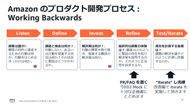
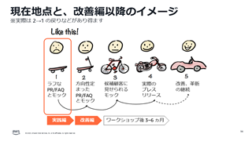
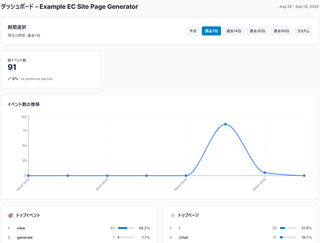

# ML Enablement Workshop

ML Enablement Workshop は、生成 AI を含めた AI/ML 技術をプロダクトの成長に繋げられるチームを組成するためのワークショップです。

| 組織横断でのチームの組成 | Amazon の開発プロセスの実践 | ~6 カ月での本番リリース |
|:--------|:---------|:------|
| |  |  |
| 企画・ビジネス側と開発側が一体で取り組む | 顧客体験から逆算して考える   [Working Backwards](https://aws.amazon.com/jp/executive-insights/content/product-management-at-amazon/#Working_Backwards.3A_being_customer_obsessed) を実践 | 生成 AI を用いた広範・並列な価値検証で実現 |

## 🚴 ワークショップの流れ

ワークショップは参加者に対しワークショップでの役割を伝える [Day0](https://github.com/aws-samples/aws-ml-enablement-workshop/blob/main/docs/organizer/day0.md) を実施後、 2 部構成のプログラムを行います。 

* [**Day0**](./docs/organizer/day0.md) で、開始条件の確認と開始前の準備事項を確認します
* [**実践編**](./docs/organizer/day1.md) で Amazon のプロダクト開発プロセスを実践し新規プロダクト / 機能のプレスリリースを複数作成します。同時に、それらを生成 AI に与え仮説検証を行うためのモックを構築します
* [**改善編**](./docs/organizer/day2.md) でモックを通じて得られた知見を統合し、参加者自信で Amazon のプロセスを実践しプレスリリースを更新します。その後、今後 3~6 カ月でリリースするための最初のステップを計画します

| Title |Day0: 目的と役割の確認|実践編: Amazon 流を実践|改善編: 仮説検証の自走を開始|
|:--------|:---------|:------|:------|
| Image ||||
| Work  | 参加者各自の役割の確認 | Working Backwards による仮説立案と並行検証の開始 | 参加者自身によるプロセス改善、リリースに向けた初期計画作成 |
| Time | 1 時間 ( リモート可 ) | 3.5 時間 | 3 時間 |

実践編で開発するモックのイメージ

生成 AI による商品ページの自動作成機能の例。だいたい 10~20 分程度で完成します。モックは、トップページ、アプリケーション機能 (レスポンスはダミーを使用)、クリックやページ計測のメトリクス集計機能の 3 つから成ります。

| トップページ | 機能ページ 1 | 機能ページ 2 |
|:--------|:---------|:------|
|  |  |  |

### お客様事例

ワークショップをご活用いただいたお客様のフィードバックをまとめています

特に生成 AI の事例については、こちらのブログをぜひご参照ください : [生成 AI を活用する鍵は組織横断のチームにあり : ML Enablement Workshop を活用した 4 つの事例から学ぶ](https://aws.amazon.com/jp/blogs/news/ml-enablement-workshop-generative-ai-cases/)

ワークショップを活用された MUFG 様が、日本の金融機関として初めて re:Invent に登壇されました！ (2024 年)

| Video | 概要 |
|:--------|:---------|
| | [**How MUFG is using generative AI to transform corporate sales: Efficient, scalable, and adaptable**](https://www.youtube.com/watch?v=G8b8LrfXSik&t=1496s)   法人営業における金融商品提案の顧客体験について、営業チームと開発チームが合同でML Enablement Workshopを実施し、理想的な体験とその実現に向けたマイルストーンを定義。営業チームが提案の価値検証を進める一方、開発チームは生成AIを活用した提案作成の自動化を推進。AWSのプロトタイピングプログラムを活用してフロントエンド開発の支援を受け、その後も開発チームによる継続的な改善を実施。その結果、わずか3ヶ月以内にリード生成が10倍に増加し、30%の成約率向上を達成するという顕著なビジネス成果を達成。 |

ワークショップの取り組みについて執筆させていただいた書籍が刊行されました (2024)

| Book | 概要 |
|:--------|:---------|
|  | **事例でわかるMLOps 機械学習の成果をスケールさせる処方箋** ([Amazon リンク](https://www.amazon.co.jp/dp/4065369568/))   機械学習を導入、運用する MLOps 全体の営みについて、インフラの技術面だけでなく機械学習を活用するカルチャーにも踏み込み、理論面に加え各社の実践例も交え解説した書籍です。  9 章である「機械学習プロジェクトの失敗確率 80% を克服するプラクティス」に本ワークショップの取り組みを寄稿しています。  ・リンク集 : [刊行記念イベント動画](https://www.youtube.com/watch?v=htFEtB33x7c&t=115s) / [登壇資料](https://mlops.connpass.com/event/328296/presentation/) / [執筆の背景と意図](https://note.com/piqcy/n/n00574e802d57) |

他ご活用いただいたお客様の声

| Customer | Quote |
|:--------|:---------|
| |  **株式会社 PKSHA Technology**   *Amazon の『Working Backwards』を一通り実施するだけでなく、その後に振り返りとブラッシュアップの機会を設けた二部構成により、当初は不確実であった機能やビジネス計画について、自らの手で見直し・改善を行うことができました。その結果、非常に実践的かつ有用なフレームワークを習得することができたと感じております。* |
| |  **BASE株式会社**   *5 つのプロダクトチームで同時並行で実施しましたが、短い時間の中でエンジニアとプロダクトマネージャーとの間で企画・実装・KPIまで濃縮された議論ができ迅速かつ効果的な生成 AI のユースケース実装につながりました* |
| |  **株式会社セゾンテクノロジー**   *ML Enablement Workshop を通じメンバーそれぞの考えを可視化・共有することで思い込みのバイアスを避け、自信を持ってコミットメントできる意思決定ができました*   ・[事例の詳細を見る](./docs/images/cases/mlew-cases-saison.png) |
|  | **株式会社三菱 UFJ 銀行**   *ML Enablement Workshop とプロトタイピングの支援により、目指すべき営業体験の創出から、検証、改善までの一連のサイクルを、迅速かつ円滑に回し始めることができました*   ・[事例の詳細を見る](./docs/images/cases/mlew-cases-mufg.png)   ・[re:Invent 2024 での登壇動画](https://www.youtube.com/watch?v=G8b8LrfXSik&t=1496s) |
|  | **株式会社ココペリ**   *ML Enablement Workshop での顧客体験分析を通じ、 Big Advance の顧客にもっともインパクトがある生成 AI の用途を特定しタスクと効果測定 KPI を決められました*  ・[事例の詳細を見る](./docs/images/cases/Kokopelli_Case.png)  ・[株式会社ココペリにおける AWS 生成 AI 事例: ML Enablement Workshop によるユースケース特定とその検証](https://aws.amazon.com/jp/blogs/news/gen-ai-usecase-kokopelli/)|
|| **株式会社ジーニー**   *ML Enablement Workshop の刺激的な体験を通じ、明確なアクションだけでなく良質な検討フレームワークを持ち帰ることができました*   ・[事例の詳細を見る](./docs/images/cases/Geniee_Case.png)|
| | **株式会社マネーフォワード**   *ML Enablement Workshopによりプロダクトマネージャー、開発者、研究開発者共同でワークショップを行った結果、機械学習の推進に不可欠なロール間のコミュニケーションが生まれました*   ・事例の詳細 : [ユーザに最高の付加価値を提供するための AI 活用に向けて](https://pages.awscloud.com/APAC_FIELD_T2_jp-isv-saas-on-aws-2022-archives-reg.html) (@ [SaaS on AWS 2022](https://pages.awscloud.com/APAC_FIELD_T2_jp-isv-saas-on-aws-2022-day1-inperson-reg.html)) |

**このほか、様々なお客様のプロダクトチームで、ワークショップをご活用頂いています**

活用頂いた事例を掲載頂ける場合は、[Issue](https://github.com/aws-samples/aws-ml-enablement-handson/issues/new?assignees=&labels=enhancement&template=case-study.md&title=)よりご連絡ください。

## 🚶 ワークショップ実施前に

ML Enablement Workshop 実施前に、**組織全体の AI/ML 活用リテラシーの向上** を行いたい場合はコミュニティ版の資料のご活用を検討ください。

### Community Workshop

#### プロダクトを成長させる生成 AI のユースケースを考えるワークショップ

プロダクトマネージャーを主な対象として、プロダクトで生成 AI を活用するためのアイデア発想、ビジネスモデル作成、また顧客起点でのプロダクト開発プロセスを学ぶためのワークショップを行っています。コミュニティでは複数社、個社では複数プロダクトのプロダクトマネージャーを集め意見交換を行うことで新しい視点で発案を促します。過去の開催レポート、発表資料は下記をご参照ください。

| Index | Image | Presentation / Report |
|:------| :-----|:----------------------|
| vol.4 |  | イベントレポート : [生成AI時代のプロダクト開発プロセス改善 - Working Backwards と Value Discovery で実践](https://note.com/piqcy/n/n40dd1180cb4e) ( この回は、プロダクト開発プロセスの改善を生成 AI とともに行うテーマで実施 )  ・[ワークショップ進行資料](https://drive.google.com/file/d/1qlpeYBfs8ZiYynqb8yMuQNZ10BbNZSiH/view)  ・[イベントページ](https://aws-startup-community.connpass.com/event/322096/)
| vol.3 |  | イベントレポート : [生成AIが活きるプロダクト体験を発見する鍵 -24のバリューキャンバスの分析から見えたもの](https://note.com/piqcy/n/n3fe552b3e5b4)  ・[ワークショップ進行資料](https://speakerdeck.com/icoxfog417/purodakutowocheng-chang-saserusheng-cheng-ai-noyusukesufa-jian-wakusiyotupu-vol-dot-3)  ・[ワーク用バリューキャンバス台紙](docs/value_canvas_A3.pdf)  ・[バリューキャンバス作成後のアクションガイド](https://pmdao.notion.site/f5baa01855884eb7b6248b36cfe2ddbc) ・[イベントページ](https://aws-startup-community.connpass.com/event/310075/)
| vol.2 |  | イベントレポート : [コミュニティの力でAIをプロダクトに組み込むアイデアに磨きをかけよう](https://note.com/piqcy/n/nf840e424698c)   AWS 大渕 麻莉: [生成系AI活用においてプロダクトマネージャーの重要性が増した説](https://speakerdeck.com/ohbuchim/sheng-cheng-xi-ai-huo-yong-nioitepurodakutomaneziyanozhong-yao-xing-gazeng-sitashuo)   Notion 早川 和輝: [Notion AIから学ぶ生成AIプロダクトの仮説検証と実践方法](https://notion.notion.site/notion/Notion-AI-AI-c42a634df5b74b3cba2574a03d165d0b)    AWS 久保 隆宏: [生成系 AI 活用用途のアイディエーションと検証](https://speakerdeck.com/icoxfog417/purodakutowocheng-chang-saserusheng-cheng-xi-ai-noyusukesuwokao-eruwakusiyotupu)   [イベントページ](https://productkintore.connpass.com/event/301832/)
| vol.1 |  | イベントレポート : [「プロダクトを成長させる生成系 AI のユースケースを考えるワークショップ」を開催しました。](https://note.com/piqcy/n/n7097e8708185)   Sansan 西田 貴紀: [Sansan LabsのLLM活⽤から考えるLLMプロジェクトの要点整理](https://speakerdeck.com/sansan_randd/llm-project-essentials-from-sansan-labs-llm-use)   株式会社Gaudiy 北川 和貴 : LLMエージェントをtoC提供して見えた可能性と難しさ (限定公開)   AWS 久保 隆宏: [生成系 AI 活用用途のアイディエーションと検証](https://speakerdeck.com/icoxfog417/purodakutowocheng-chang-saserusheng-cheng-xi-ai-noyusukesuwokao-eruwakusiyotupu)    [イベントページ](https://productkintore.connpass.com/event/296335/)  |

個社開催も実績があります。

| Index | Image | Customer Report |
|:------| :-----|:----------------------|
| 1     |       | **株式会社リクルート** : [社内での生成AI活用推進を成功させる実践方法](https://blog.recruit-productdesign.jp/n/n561955e2a147)   *AWS様にご協力いただき、生成AIのアイディア 出しからビジネスモデル作成まで行う社内向けワークショップが開催されました。趣旨としては、リクルートに所属する約50名のエンジニアやPdMが協働し、課題を基にした議論を重ねながら生成AIの具体的ユースケースを検討するというものです。*   *実際に私自身も参加したのですが、新規ビジネスや既存業務の問題・課題に対して、様々な観点でブレインストーミングを行い、PSF（Problem Solution Fit）を整理する中で新たな知見を深めることができました。* |
| 2     |  | **株式会社NTTデータ イントラマート** : [プロダクトを成長させる生成系 AI のユースケースを考えるワークショップ実施レポート](https://dev.intra-mart.jp/%e3%83%97%e3%83%ad%e3%83%80%e3%82%af%e3%83%88%e3%82%92%e6%88%90%e9%95%b7%e3%81%95%e3%81%9b%e3%82%8b%e7%94%9f%e6%88%90%e7%b3%bb-ai-%e3%81%ae%e3%83%a6%e3%83%bc%e3%82%b9%e3%82%b1%e3%83%bc%e3%82%b9/)   *生成AIを活用した様々な機能強化を進めていくべく、AWS様と共同で「プロダクトを成長させる生成系 AI のユースケースを考えるワークショップ」を実施しました*   *製品開発やサービスの主要なメンバーと意見交換しながら多様なアイディアを出す事ができ、非常に良い経験となりました。* |

## 🏃‍♀️ ワークショップ実施後に

ワークショップ実施後の素早いプロトタイプ構築のために AWS として様々なアセットを公開しています。

### 生成 AI の AWS 実装集

[AWS Generative AI Solution Box](https://aws-samples.github.io/sample-one-click-generative-ai-solutions/) から、下記ソリューションを含め AWS アカウントがあればワンクリック・十分程度でデプロイが出来ます。

[生成 AI 事例集](https://aws.amazon.com/jp/local/genai-4-jp/) により、様々な企業の事例を参照できます。

| Image | Detail |
|:------| :------|
| | [generative-ai-use-cases](https://github.com/aws-samples/generative-ai-use-cases-jp)   生成 AI の様々なユースケースをワンストップで試せるアプリケーションです。チャットはもちろん、要約、画像生成、検索拡張生成、文書校正、翻訳、 Web コンテンツの抽出といった機能をすぐに試し効果を体感できます。 |
|  | [bedrock-claude-chat](https://github.com/aws-samples/bedrock-claude-chat)   生成 AI のチャット機能をすばやくかつセキュアにデプロイできるアプリケーションです。検索拡張生成、またシステムプロンプトを埋め込んだカスタムボットの共有などチャットに特化した機能を提供しています。 |

### AI/ML の AWS 実装集

| Image | Detail |
|:------| :------|
| | [aws-ml-jp](https://github.com/aws-samples/aws-ml-jp)   AWS の AI/ML サービスのサンプルコード、また学習コンテンツを提供するリポジトリです。 Amazon SageMaker を利用したモデルの学習はもちろん、基盤モデルの Fine Tuning のサンプル実装なども提供しています。 |
| | [awesome-studio-lab-jp](https://github.com/aws-sagemaker-jp/awesome-studio-lab-jp)   AWS アカウント不要かつ無料で利用できる Amazon SageMaker Studio Lab で学べる機械学習のコンテンツを集めたリポジトリです。 |

### 機械学習プロジェクト体験ハンズオン

開発者向けの機械学習ハンズオン資料です。
目次のNo.1から順に進めていくことで各開発プロセスでなにを行うのか、なぜ行うのか、どう行うのかを学ぶことができます。ハンズオンは Amazon SageMaker Studio Lab を使用し進めます。アカウントの作成方法や使い方は[Amazon SageMaker Studio Lab の使い方](https://github.com/aws-sagemaker-jp/awesome-studio-lab-jp/blob/main/README_usage.md)を参照してください。

|No   |Process|Title|Content|Video|
|:----|:------|:----|:----|:----|
|1    |Introduction|機械学習モデル開発プロジェクトの進め方|||
|2    |Environment Setup|機械学習モデルの開発環境を構築する|||
|3    |Business Understanding|機械学習の価値を計算する|||
|4    |Analyze|データから価値を創出できるか診断する|||
|5    |Prepare|診断結果に基づきデータを充足する|||
|6    |Preprocess|機械学習モデルが認識しやすいデータにする||  |
|7    |Train|機械学習モデルを学習する|||
|8    |Test|機械学習モデルを評価する||(Comming Soon)|
|9    |Ending|機械学習モデルの開発から運用へ||(Comming Soon)|

#### シナリオ別ハンズオン

特定のシナリオで AI/ML のプロジェクトを企画から実装まで学べるハンズオンコンテンツです。

* [サービスの解約率改善シナリオ](./notebooks/scenario_churn/) ( 所要時間 2~3 時間 )
   * 携帯電話会社での解約率改善を題材に、ビジネス理解からモデルのテストまで一気通貫で体験できるハンズオン。

## ML Enablement Workshop に関する FAQ

* ML Enablement Workshop は誰が開発し、メンテナンスしているのですか ?
   * AWS が開発し、メンテナンスしています。本資料には AWS でお客様の AI/ML を活用したノウハウが詰め込まれています。具体的な改善の過程については以下記事をご参照ください。
   * [AI/ML活用の勝ちパターンを学ぶ！AWS の人気ワークショップがAmazon流に生まれ変わり登場](https://note.com/piqcy/n/n3f45aefc9434) : ML Enablement Workshop の v2 へのメジャーバージョンアップの背景について記載した記事です。
   * [機械学習プロジェクトの約80%が失敗するのは伊達ではないと実感したが、現実に負けないワークショップに挑戦する](https://note.com/piqcy/n/n9c9e97896596) : ML Enablement Workshop 改善版 (v1.1) について、改善前の課題と改善後のポイントをまとめた記事です。
   * [機械学習モデル開発プロジェクトの体験ハンズオンを公開しました](https://note.com/piqcy/n/n51ffb8e02293) : 初版公開時の記事です。
   * AWS だけでなく、 Amazon, Spotify, Uber など世界的なプロダクトのマネージャーがどのように機械学習を活用しているか調査し、その内容も反映しています。関心ある方は **[データサイエンスを活用するプロダクトマネージャーを訪ねて](docs/journal/README.md)** を参照ください。
* ML Enablement Workshop はどのように実施すればよいのですか ?
   * 提供条件がそろえば AWS から提供できます ( 詳細は御社 AWS 担当までご連絡ください ) 。資料はすべて公開しているので、 [開催者向けガイド](https://github.com/aws-samples/aws-ml-enablement-workshop/tree/main/docs/organizer)を参照し自社内で実施することもできます。
* ML Enablement Workshop を利用するのに料金や許可は必要ですか ?
   * いいえ。 GitHub で オープンソースとして公開しているので、 [ライセンスの範囲](LICENSE)で無料で利用頂くことができます。ただ、 AWS 以外の個人や法人が「 ML Enablement Workshop 」の名称もしくは同一とみなされる名称でワークショップを開催することを禁止します。お客様の混乱を防ぐための措置で、ご理解をお願い致します。
* AWS のサービスはワークショップに関わらないのですか ?
   * 最新のワークショップでは AI Coding Agent の活用が必須であり、AWS は [Amazon Q Developer CLI](https://docs.aws.amazon.com/ja_jp/amazonq/latest/qdeveloper-ug/command-line.html) の使用を推奨しています。
* AWS はなぜ ML Enablement Workshop の開発・改善をしているのですか ? 
   * AI/ML の本番環境での利用を拡大するためです。これはお客様の利益にもなり、 AWS にとっても本番で AWS の AI/ML のサービスが利用さることはビジネスの拡大に不可欠です。
   * 特に日本ではデータを活用した企画や業務改善を主導できる人材が 20% 程度と米国の約 1/3 に留まり、 スタートアップでも技術革新を受けプロダクトのピボットを検討した企業は 1 割程度に留まります。この差が、 AI の導入効果が米国に比べ約 1/7 、スタートアップの成長率は約 1/30 と大きく乖離する一因になっています。関心ある方は以下の資料もご参照ください。
   * [日本のAI導入効果がアメリカの7分の1程度しかないのはなぜなのか](https://note.com/piqcy/n/na971fee54568) : 📹[動画](https://www.youtube.com/watch?v=Uxip1ggPwtw)
   * [日本のスタートアップ企業の成長速度が米国に比べ30分の1以下という現状にデータサイエンティストは何ができるか](https://note.com/piqcy/n/n66c93427d8f0)
* ML Enablement Workshop を AI/ML の活用を推進するための社内勉強会として実施することはできますか ? 
   * いいえ。 ML Enablement Workshop はアクションプランを作るためのワークショップで、研修を目的としていません。実施に際しては、特定のプロダクト、プロダクト機能を選定して頂く必要があります。
   * [プロダクトを成長させる生成 AI のユースケースを考えるワークショップ](https://speakerdeck.com/icoxfog417/purodakutowocheng-chang-saserusheng-cheng-xi-ai-noyusukesuwokao-eruwakusiyotupu) は 2~3 時間でユースケースの発案、検証が行えるプログラムになっています。詳細は追加コンテンツを参照してください。

### 外部登壇資料

* [溶け込むラジオ出演](https://open.spotify.com/show/2cM4nkI88ySjFBUfQK9U74)
   * ML Enablement Workshop 開発の経緯や得られた知見についてポッドキャストでお話ししました。
   * [価値ある機械学習プロダクトを生み出すチームの作り方 Part1](https://open.spotify.com/episode/3K6bvHv3534EuliGGlpceI)
   * [価値ある機械学習プロダクトを生み出すチームの作り方 Part2](https://open.spotify.com/episode/0olbtEAxxhysO8Xe2jqSHA)
* [大規模言語モデルを Fine Tuning すべきタイミングとその方法](https://speakerdeck.com/icoxfog417/da-gui-mo-yan-yu-moderuwo-fine-tuning-subekitaimingutosonofang-fa)
   * プロダクトを生成 AI で成長させるのになぜ Fine Tuning が必要なのか、どのような手順で進めればよいのかを解説したスライドです。Biz 、Dev 、 ML の 3 ステップのプロセスを紹介し Biz フェーズの支援として ML Enablement Workshop を紹介しています。
* [ゲーム業界における生成AIの活用](https://speakerdeck.com/icoxfog417/gemuye-jie-niokerusheng-cheng-xi-ainohuo-yong)
   * ゲーム業界で生成 AI を活用している事例と、活用のためのポイントをまとめた発表した記事です。
* [プロダクトの成長をリードする生成 AI の活用戦略](https://speakerdeck.com/icoxfog417/purodakutonocheng-chang-woridosurusheng-cheng-xi-ai-nohuo-yong-zhan-lue)
   * 短期的な生成 AI のお試しから、長期的なプロダクトの差別化につなげる戦略の立て方を解説した資料です。Biz 、Dev 、 ML の 3 ステップについて、 生成 AI の活用事例をベースにポイントを解説しています。

## 改善要望

ハンズオンコンテンツについてのご要望や質問を歓迎します！事前に [CONTRIBUTING](CONTRIBUTING.md#security-issue-notifications)に目を通して頂ければ幸いです。

* [ご要望/不具合報告へのリンク (Issue) ](https://github.com/aws-samples/aws-ml-enablement-workshop/issues/new/choose)
* [コンテンツ/不具合の改善送付 (Pull Request)](https://github.com/aws-samples/aws-ml-enablement-workshop/compare)
* ご質問: [GitHub Discussion](https://github.com/aws-samples/aws-ml-enablement-handson/discussions)
* セキュリティに関するご連絡: [CONTRIBUTING](CONTRIBUTING.md#security-issue-notifications)

## ライセンス

[MIT-0 License](LICENSE)
