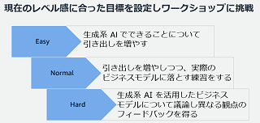
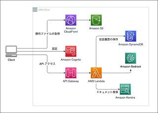
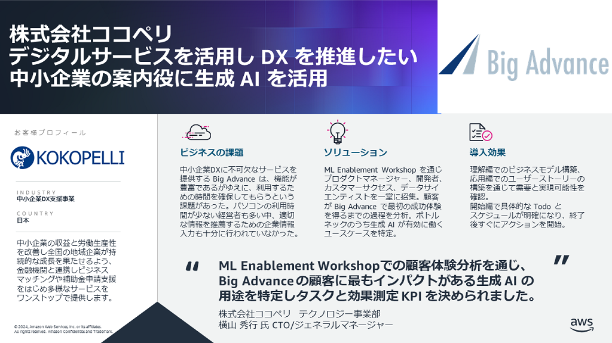

# ML Enablement Workshop

プロダクトを機械学習 / 生成 AI により継続的に成長させるロードマップが作れるワークショップです。本ワークショップの特徴をお客様の声と共に紹介します ( リンク先で事例を紹介しています ) 。

🚀 : **1~3 カ月以内**で成果や学びが得られるマイルストンを設定し、終了後すぐに行動を開始できる。
* [*ワークショップ内に開発チームの Todo リストまで落とし込み、翌日から進捗確認の定例を開始できた*](https://github.com/aws-samples/aws-ml-enablement-workshop/tree/main?tab=readme-ov-file#%E6%A0%AA%E5%BC%8F%E4%BC%9A%E7%A4%BE%E3%82%B8%E3%83%BC%E3%83%8B%E3%83%BC)

📏 : **計測可能な KPI**を決めることで、計測に基づきロードマップの修正ができるようにする。
* [*ML Enablement Workshop での顧客体験分析を通じ、もっともインパクトのある用途を特定しタスクと効果測定 KPI を決められた*](https://github.com/aws-samples/aws-ml-enablement-workshop/tree/main?tab=readme-ov-file#%E6%A0%AA%E5%BC%8F%E4%BC%9A%E7%A4%BE%E3%82%B3%E3%82%B3%E3%83%9A%E3%83%AA)

⚽ : **企画・ビジネス側と開発側が一体でユーザー理解を深める**プロセスを提供し、プロダクト開発チームのコミュニケーションを改善する

* [*ML Enablement Workshopによりプロダクトマネージャー、開発者、研究開発者共同でワークショップを行った結果、機械学習の推進に不可欠なロール間のコミュニケーションが生まれた*](https://github.com/aws-samples/aws-ml-enablement-workshop/tree/main?tab=readme-ov-file#%E6%A0%AA%E5%BC%8F%E4%BC%9A%E7%A4%BE%E3%83%9E%E3%83%8D%E3%83%BC%E3%83%95%E3%82%A9%E3%83%AF%E3%83%BC%E3%83%89)

## :books: ワークショップ資料

ワークショップは参加者に対しワークショップでの役割を伝える [Day0](https://github.com/aws-samples/aws-ml-enablement-workshop/blob/main/docs/organizer/day0.md) を実施後、 3 部構成のプログラムを行います。各パートの解説と資料は、 Title のリンクからアクセスできます。

| Title |[理解編: 成長サイクルの理解](docs/organizer/day1.md)|[応用編: 顧客体験改善への応用](docs/organizer/day2.md)|[開始編: 検証/実装を開始する](docs/organizer/day3.md)|
|:--------|:---------|:------|:------|
| Image ||||
| Work  | 事例に基づくビジネスモデル作成 | 顧客への提案シナリオ作成と反応の予測 | 1 ~3 カ月のマイルストン作成 |
| Time | 3 時間 | 4 時間 | 3 時間 |

**理解編**で、プロダクトが機械学習で成長する仕組みを学び、事例を参考に自社のビジネスモデルを設計します。  
**応用編**で、顧客への提案シナリオを構築、シミュレーションし予測される反応を洗い出します。  
**開始編**で、ビジネス価値を着実に積みつつ検証を進めていくための段階的なステップを設計します。

## ⚡ 補完コンテンツ

ML Enablement Workshop は特定プロダクトにおける AI/ML のユースケース発見と行動計画作成にフォーカスしています。フェーズとしてはプロトタイピングの段階での実施が適しており、前段の学習や検証、後段の実装のフェーズでは下表のとおり補完関係にあるコンテンツの利用をご検討ください。

| Phase |学習・検証|プロトタイピング|実装・展開|
|:--------|:---------|:------|:------|
| Image ||||
| Purpose  | 組織全体の AI/ML 活用リテラシーの向上 | ユースケースの発見とロードマップ作成 | 実装の開始、本番展開 |
| Content | Community Workshop | ML Enablement Workshop | AWS Samples |
| Time | 2~3 時間 | 10 時間 | 1~3 時間 |

### Community Workshop

#### プロダクトを成長させる生成 AI のユースケースを考えるワークショップ

プロダクトマネージャーを対象に、プロダクトで生成 AI を活用するためのアイデアを発想、検証するためのワークショップです。1) 生成 AI 活用のポイント、 2) アイディエーション、 3) ビジネスモデルキャンバスを利用したアイデアの効果検証、の 3 パートから成ります。 3 パートのどの段階まで行くかは、 Easy / Normal / Hard の 3 段階から選べるようになっています。

コミュニティでの開催を想定しており、複数の会社のプロダクトマネージャーらを集め意見交換を行うことで新しい視点で発案を促します。過去の開催レポート、発表資料は下記をご参照ください。

| Index | Image | Presentation / Report |
|:------| :-----|:----------------------|
| vol.3 |  | [イベントページ](https://aws-startup-community.connpass.com/event/310075/)  ・[ワークショップ進行資料](https://speakerdeck.com/icoxfog417/purodakutowocheng-chang-saserusheng-cheng-ai-noyusukesufa-jian-wakusiyotupu-vol-dot-3)  ・[ワーク用バリューキャンバス台紙](docs/value_canvas_A3.pdf)  ・[バリューキャンバス作成後のアクションガイド](https://pmdao.notion.site/f5baa01855884eb7b6248b36cfe2ddbc) イベントレポート : [生成AIが活きるプロダクト体験を発見する鍵 -24のバリューキャンバスの分析から見えたもの](https://note.com/piqcy/n/n3fe552b3e5b4)
| vol.2 |  | [イベントページ](https://productkintore.connpass.com/event/301832/)   AWS 大渕 麻莉: [生成系AI活用においてプロダクトマネージャーの重要性が増した説](https://speakerdeck.com/ohbuchim/sheng-cheng-xi-ai-huo-yong-nioitepurodakutomaneziyanozhong-yao-xing-gazeng-sitashuo)   Notion 早川 和輝: [Notion AIから学ぶ生成AIプロダクトの仮説検証と実践方法](https://notion.notion.site/notion/Notion-AI-AI-c42a634df5b74b3cba2574a03d165d0b)    AWS 久保 隆宏: [生成系 AI 活用用途のアイディエーションと検証](https://speakerdeck.com/icoxfog417/purodakutowocheng-chang-saserusheng-cheng-xi-ai-noyusukesuwokao-eruwakusiyotupu)   イベントレポート : [コミュニティの力でAIをプロダクトに組み込むアイデアに磨きをかけよう](https://note.com/piqcy/n/nf840e424698c)
| vol.1 |  | [イベントページ](https://productkintore.connpass.com/event/296335/)   Sansan 西田 貴紀: [Sansan LabsのLLM活⽤から考えるLLMプロジェクトの要点整理](https://speakerdeck.com/sansan_randd/llm-project-essentials-from-sansan-labs-llm-use)   株式会社Gaudiy 北川 和貴 : LLMエージェントをtoC提供して見えた可能性と難しさ (限定公開)   AWS 久保 隆宏: [生成系 AI 活用用途のアイディエーションと検証](https://speakerdeck.com/icoxfog417/purodakutowocheng-chang-saserusheng-cheng-xi-ai-noyusukesuwokao-eruwakusiyotupu)   イベントレポート : [「プロダクトを成長させる生成系 AI のユースケースを考えるワークショップ」を開催しました。](https://note.com/piqcy/n/n7097e8708185)|

個社開催も実績があります。

* NTT DATA Intramart : [プロダクトを成長させる生成系 AI のユースケースを考えるワークショップ実施レポート](https://dev.intra-mart.jp/%e3%83%97%e3%83%ad%e3%83%80%e3%82%af%e3%83%88%e3%82%92%e6%88%90%e9%95%b7%e3%81%95%e3%81%9b%e3%82%8b%e7%94%9f%e6%88%90%e7%b3%bb-ai-%e3%81%ae%e3%83%a6%e3%83%bc%e3%82%b9%e3%82%b1%e3%83%bc%e3%82%b9/)

### AWS Smaples

開発者、データサイエンティストを対象に、実装のフェーズで役立つサンプルを提供しています。

#### 生成 AI の AWS 実装集

| Image | Detail |
|:------| :------|
| | [generative-ai-use-cases](https://github.com/aws-samples/generative-ai-use-cases-jp)   生成 AI の様々なユースケースをワンストップで試せるアプリケーションです。チャットはもちろん、要約、画像生成、検索拡張生成、文書校正、翻訳、 Web コンテンツの抽出といった機能をすぐに試し効果を体感できます。 |
|  | [bedrock-claude-chat](https://github.com/aws-samples/bedrock-claude-chat)   生成 AI のチャット機能をすばやくかつセキュアにデプロイできるアプリケーションです。検索拡張生成、またシステムプロンプトを埋め込んだカスタムボットの共有などチャットに特化した機能を提供しています。 |

#### AI/ML の AWS 実装集

| Image | Detail |
|:------| :------|
| | [aws-ml-jp](https://github.com/aws-samples/aws-ml-jp)   AWS の AI/ML サービスのサンプルコード、また学習コンテンツを提供するリポジトリです。 Amazon SageMaker を利用したモデルの学習はもちろん、基盤モデルの Fine Tuning のサンプル実装なども提供しています。 |
| | [awesome-studio-lab-jp](https://github.com/aws-sagemaker-jp/awesome-studio-lab-jp)   AWS アカウント不要かつ無料で利用できる Amazon SageMaker Studio Lab で学べる機械学習のコンテンツを集めたリポジトリです。 |

#### 機械学習プロジェクト体験ハンズオン

開発者向けの機械学習ハンズオン資料です。
目次のNo.1から順に進めていくことで各開発プロセスでなにを行うのか、なぜ行うのか、どう行うのかを学ぶことができます。ハンズオンは Amazon SageMaker Studio Lab を使用し進めます。アカウントの作成方法や使い方は[Amazon SageMaker Studio Lab の使い方](https://github.com/aws-sagemaker-jp/awesome-studio-lab-jp/blob/main/README_usage.md)を参照してください。

|No   |Process|Title|Content|Video|
|:----|:------|:----|:----|:----|
|1    |Introduction|機械学習モデル開発プロジェクトの進め方|||
|2    |Environment Setup|機械学習モデルの開発環境を構築する|||
|3    |Business Understanding|機械学習の価値を計算する|||
|4    |Analyze|データから価値を創出できるか診断する|||
|5    |Prepare|診断結果に基づきデータを充足する|||
|6    |Preprocess|機械学習モデルが認識しやすいデータにする||  |
|7    |Train|機械学習モデルを学習する|||
|8    |Test|機械学習モデルを評価する||(Comming Soon)|
|9    |Ending|機械学習モデルの開発から運用へ||(Comming Soon)|

#### シナリオ別ハンズオン

特定のシナリオで AI/ML のプロジェクトを企画から実装まで学べるハンズオンコンテンツです。

* [サービスの解約率改善シナリオ](./notebooks/scenario_churn/) ( 所要時間 2~3 時間 )
   * 携帯電話会社での解約率改善を題材に、ビジネス理解からモデルのテストまで一気通貫で体験できるハンズオン。

## ML Enablement Workshop に関する FAQ

* ML Enablement Workshop は誰が開発し、メンテナンスしているのですか ?
   * AWS が開発し、メンテナンスしています。本資料には AWS でお客様の AI/ML を活用したノウハウが詰め込まれています。具体的な改善の過程については以下記事をご参照ください。
   * [機械学習プロジェクトの約80%が失敗するのは伊達ではないと実感したが、現実に負けないワークショップに挑戦する](https://note.com/piqcy/n/n9c9e97896596) : ML Enablement Workshop 改善版について、改善前の課題と改善後のポイントをまとめた記事です。
   * [機械学習モデル開発プロジェクトの体験ハンズオンを公開しました](https://note.com/piqcy/n/n51ffb8e02293) : 初版公開時の記事です。
   * AWS だけでなく、 Amazon, Spotify, Uber など世界的なプロダクトのマネージャーがどのように機械学習を活用しているか調査し、その内容も反映しています。関心ある方は **[データサイエンスを活用するプロダクトマネージャーを訪ねて](docs/journal/README.md)** を参照ください。
* ML Enablement Workshop はどのように実施すればよいのですか ?
   * 提供条件がそろえば AWS から提供できます ( 詳細は御社 AWS 担当までご連絡ください ) 。資料はすべて公開しているので、 [開催者向けガイド](https://github.com/aws-samples/aws-ml-enablement-workshop/tree/main/docs/organizer)を参照し自社内で実施することもできます。
* ML Enablement Workshop を利用するのに料金や許可は必要ですか ?
   * いいえ。 GitHub で オープンソースとして公開しているので、 [ライセンスの範囲](LICENSE)で無料で利用頂くことができます。ただ、 AWS 以外の個人や法人が「 ML Enablement Workshop 」の名称もしくは同一とみなされる名称でワークショップを開催することを禁止します。お客様の混乱を防ぐための措置で、ご理解をお願い致します。
* AWS のサービスはワークショップに関わらないのですか ?
   * ワークショップ以後、特定したユースケースを実装する際に AWS のサービスを活用いただけます。手軽に生成 AI が使える [Amazon Bedrock](https://aws.amazon.com/jp/bedrock/) や無料で Jupyter Notebook が使える [Amazon SageMaker Studio Lab](https://studiolab.sagemaker.aws/) から、機械学習の継続的な学習に不可欠な MLOps を構築する [Amazon SageMaker](https://aws.amazon.com/jp/sagemaker/) まで、幅広なサービスと [生成 AI イノベーションセンター](https://aws.amazon.com/jp/about-aws/whats-new/2023/06/aws-announces-generative-ai-innovation-center/) 等の実装支援プログラムでユースケースの実現まで伴走します。
* AWS はなぜ ML Enablement Workshop の開発・改善をしているのですか ? 
   * AI/ML の本番環境での利用を拡大するためです。これはお客様の利益にもなり、 AWS にとっても本番で AWS の AI/ML のサービスが利用さることはビジネスの拡大に不可欠です。
   * 特に日本ではデータを活用した企画や業務改善を主導できる人材が 20% 程度と米国の約 1/3 に留まり、 スタートアップでも技術革新を受けプロダクトのピボットを検討した企業は 1 割程度に留まります。この差が、 AI の導入効果が米国に比べ約 1/7 、スタートアップの成長率は約 1/30 と大きく乖離する一因になっています。関心ある方は以下の資料もご参照ください。
   * [日本のAI導入効果がアメリカの7分の1程度しかないのはなぜなのか](https://note.com/piqcy/n/na971fee54568) : 📹[動画](https://www.youtube.com/watch?v=Uxip1ggPwtw)
   * [日本のスタートアップ企業の成長速度が米国に比べ30分の1以下という現状にデータサイエンティストは何ができるか](https://note.com/piqcy/n/n66c93427d8f0)
* ML Enablement Workshop は生成 AI の活用にも適用できますか ?
   * はい。実際、ココペリ様では生成 AI のユースケースについて検討頂き本番導入に向けた検証まで進んでいただいています( [事例](https://github.com/aws-samples/aws-ml-enablement-workshop?tab=readme-ov-file#%E6%A0%AA%E5%BC%8F%E4%BC%9A%E7%A4%BE%E3%82%B3%E3%82%B3%E3%83%9A%E3%83%AA)、[技術検証記事](https://note.com/kokopelli_inc/n/nc2a18f4afe76) )。
* ML Enablement Workshop を AI/ML の活用を推進するための社内勉強会として実施することはできますか ? 
   * いいえ。 ML Enablement Workshop はアクションプランを作るためのワークショップで、研修を目的としていません。実施に際しては、特定のプロダクト、プロダクト機能を選定して頂く必要があります。
   * [プロダクトを成長させる生成 AI のユースケースを考えるワークショップ](https://speakerdeck.com/icoxfog417/purodakutowocheng-chang-saserusheng-cheng-xi-ai-noyusukesuwokao-eruwakusiyotupu) は 2~3 時間でユースケースの発案、検証が行えるプログラムになっています。詳細は追加コンテンツを参照してください。

## お客様事例

### [株式会社マネーフォワード](https://corp.moneyforward.com/)

**[ユーザに最高の付加価値を提供するための AI 活用に向けて](https://pages.awscloud.com/APAC_FIELD_T2_jp-isv-saas-on-aws-2022-archives-reg.html)** (@ [SaaS on AWS 2022](https://pages.awscloud.com/APAC_FIELD_T2_jp-isv-saas-on-aws-2022-day1-inperson-reg.html))  
マネーフォワードでは 「Money Forwardクラウド」 の中長期の重要テーマとしてバックオフィス業務の自動・自律化を目指す 「Autonomous Backoffice」 を標榜し、AI 活用の取組みを進めています。推進するうえでの課題や課題に対する取組み、今後の展望についてお伝えするとともに、AI ユースケース創出のための取組みとして、AWS 支援による PdM を対象としたワークショップについてもご紹介します。|

### [株式会社ジーニー](https://geniee.co.jp/)

競争の激しい広告プラットフォーム事業で、継続的にインパクトのあるユースケースを生み出せるチームを組成するために ML Enablement Workshop を活用。組織横断で企画立案から検証計画まで一気通貫で作成し、ワークショップ終了翌日から進捗確認の定例を開始する迅速な立ち上がりを実現。

### [株式会社ココペリ](https://www.kokopelli-inc.com/)

中小企業 DX に不可欠なサービスを提供する Big Advance で、豊富な機能を限られた時間で活用できるようカスタマージャーニーを整理し、生成 AI を用いたユースケースの検証を終了後すぐに実施。お客様からの記事もご参照ください。

* [AWSが開催する「ML Enablement Workshop」に参加します](https://www.kokopelli-inc.com/all/news/4323/)
* [ビジネスマッチングでのClaudeによる文章生成](https://note.com/kokopelli_inc/n/nc2a18f4afe76)

**様々なお客様のプロダクトチームで、ワークショップをご活用頂いています**

活用頂いた事例を掲載頂ける場合は、[Issue](https://github.com/aws-samples/aws-ml-enablement-handson/issues/new?assignees=&labels=enhancement&template=case-study.md&title=)よりご連絡ください。

### 外部登壇資料

* [溶け込むラジオ出演](https://open.spotify.com/show/2cM4nkI88ySjFBUfQK9U74)
   * ML Enablement Workshop 開発の経緯や得られた知見についてポッドキャストでお話ししました。
   * [価値ある機械学習プロダクトを生み出すチームの作り方 Part1](https://open.spotify.com/episode/3K6bvHv3534EuliGGlpceI)
   * [価値ある機械学習プロダクトを生み出すチームの作り方 Part2](https://open.spotify.com/episode/0olbtEAxxhysO8Xe2jqSHA)
* [大規模言語モデルを Fine Tuning すべきタイミングとその方法](https://speakerdeck.com/icoxfog417/da-gui-mo-yan-yu-moderuwo-fine-tuning-subekitaimingutosonofang-fa)
   * プロダクトを生成 AI で成長させるのになぜ Fine Tuning が必要なのか、どのような手順で進めればよいのかを解説したスライドです。Biz 、Dev 、 ML の 3 ステップのプロセスを紹介し Biz フェーズの支援として ML Enablement Workshop を紹介しています。
* [ゲーム業界における生成AIの活用](https://speakerdeck.com/icoxfog417/gemuye-jie-niokerusheng-cheng-xi-ainohuo-yong)
   * ゲーム業界で生成 AI を活用している事例と、活用のためのポイントをまとめた発表した記事です。
* [プロダクトの成長をリードする生成 AI の活用戦略](https://speakerdeck.com/icoxfog417/purodakutonocheng-chang-woridosurusheng-cheng-xi-ai-nohuo-yong-zhan-lue)
   * 短期的な生成 AI のお試しから、長期的なプロダクトの差別化につなげる戦略の立て方を解説した資料です。Biz 、Dev 、 ML の 3 ステップについて、 生成 AI の活用事例をベースにポイントを解説しています。

## 改善要望

ハンズオンコンテンツについてのご要望や質問を歓迎します！事前に [CONTRIBUTING](CONTRIBUTING.md#security-issue-notifications)に目を通して頂ければ幸いです。

* [ご要望/不具合報告へのリンク (Issue) ](https://github.com/aws-samples/aws-ml-enablement-workshop/issues/new/choose)
* [コンテンツ/不具合の改善送付 (Pull Request)](https://github.com/aws-samples/aws-ml-enablement-workshop/compare)
* ご質問: [GitHub Discussion](https://github.com/aws-samples/aws-ml-enablement-handson/discussions)
* セキュリティに関するご連絡: [CONTRIBUTING](CONTRIBUTING.md#security-issue-notifications)

## ライセンス

[MIT-0 License](LICENSE)
