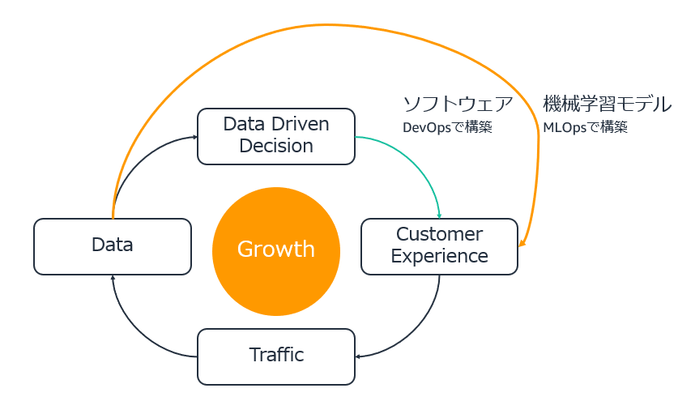
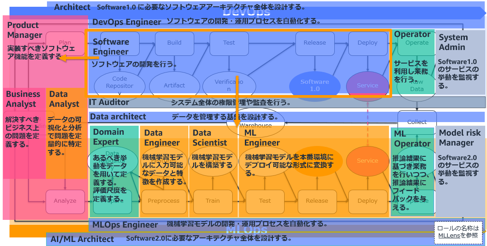

# はじめに

## ハンズオンの概要

本ハンズオンを通じ、機械学習モデルがビジネス価値に貢献するよう開発する方法を学ぶことができます。機械学習モデルの要件確認から運用監視までを10のプロセスで定義し、そのうち「開発」にあたる6つのプロセスを本教材の対象としています。次の図では、既存のソフトウェア開発プロセスをDevOpsとし、機械学習モデルの開発プロセスをMLOpsとし上下に分けて示しています。本教材の対象は、図のオレンジの枠で囲った箇所です。

| 英語名                 | 日本語名     | なにをするのか                             |
|------------------------|--------------|---------------------------------------|
| Business Understanding | ビジネス理解 | ビジネス上発生している問題を機械学習モデルの予測がどのように解決するのか、関係者へのヒアリングを通じ理解しBusiness goalを設定する。                               |
| Analyze                | データ分析   | Business goalを達成するために現状手に入るデータが必要十分であるか、データ分析を行いAnalysis Reportを作成する。                                              |
| Prepare                | データ準備   | Analysis Reportをステークホルダーに共有し、必要なデータや不足しているデータの収集や作成を行いDatasetを作成する。                                          |
| Preprocess             | 前処理       | Datasetを機械学習モデルが認識しやすい形に変換し、Preprocessed   Datasetを作成する。必要に応じデータ同士を組み合わせて新しいデータを作るFeature Engineeringを行う。|
| Train                  | 学習         | Preprocessed Datasetを用い、Modelを学習する。                                                                                                    |
| Test                   | テスト       | Modelが意図した通りに構築されているか、インプット、プロセス、アウトプットの観点から評価しTest Reportを作成する。Test   Reportには、Business goalを達成できているかの評価を含める。 |

各プロセスの解説は、**なにをするのか**、**なぜやるのか**、**どうやるのか**の3つから構成されます。どうやるのかは、**プログラミング演習**と**コミュニケーション演習**の2つから構成されます。機械学習モデルを開発するためのプログラミングはプログラミング演習で、開発の手順や内容を確認するため他のロールの方に行うべき依頼をコミュニケーション演習で行います。

1. なにをするのか
2. なぜやるのか
3. どうやるのか
   * プログラミング演習
   * コミュニケーション演習

プログラミング演習ではPythonとscikit-learnを用いた基本的な機械学習モデルの構築を行います。TensorFlowやPyTorchでDeep Learningのモデルを構築する方法は扱っていません。ただ、Deep Learningでも機械学習モデルの開発プロセスは変わらないためプロジェクトの進め方として参考になると思います。また、機械学習の理論的な内容は解説していません。実務上より深い知識が求められるようになった場合に備え、各プロセスで参考書籍を記載しているためそちらを参照いただければと思います。

各プロセスの学習時間は10~20分程度です。`README.md`の目次に沿い、自習形式で進めることが可能です。ただ、他のチームメンバーを巻き込んでコミュニケーション演習を行うことでより実際の機械学習モデルの開発に近い演習ができます。

学習環境として、メールアドレスのみかつ無料でJupyterLab環境が扱える[Amazon SageMaker Studio Lab](https://studiolab.sagemaker.aws/)を使用しています。アカウントがない場合は、[Request Account](https://bit.ly/3OZJEFv)より作成できます。

## ハンズオンのゴール

ハンズオンのゴールは、プロダクトへの機械学習導入プロジェクトに参加するソフトウェアエンジニアの方が、データサイエンティストの方と協調して開発を進めるのに必要十分な知識が得られることです。

具体的には次の3つのアクションが取れるようになって頂きたいと思います。

1. Pythonで機械学習の基本的な実装を行えるようになる。
2. 開発に関わる他のステークホルダーに、Jupyter Notebookを提示しながら必要な確認をとれるようになる。
3. データサイエンティストに対し適切な声掛けができるようになる。

ハンズオン実施者は、プロジェクトにおいてプロダクトを開発するDevOpsチームと機械学習モデルを開発するMLOpsチームの橋渡しが担えるようになることが期待されます。

## ハンズオンが生まれた理由

機械学習の導入プロジェクトは[80%が失敗する](https://research.aimultiple.com/ai-fail/)といわれています。理由として次の5つが上げられていますが、注目すべき点は「データサイエンティストなどの専門職の不在」よりもビジネス目標の不明瞭さやチーム間の連携不足など、組織的な問題がより失敗の鍵を握っているということです。

1. ビジネスの目標がはっきりしていない
2. データの品質が不十分
3. プロジェクトのスポンサーが不在
4. チーム間の連携が不十分
5. データサイエンティストなどの専門職の不在

データサイエンティストは機械学習モデルを構築できても「成功裏にプロダクトに導入する」ことはできないということです。次の図は最初に提示したDevOpsとMLOpsが並走する機械学習導入後のプロダクト開発プロセスに担当するロールをマッピングした図ですが、多くのロールが実現に関わることがわかると思います。本ハンズオンがプログラミング演習だけでなく、なぜ、なにを、といった根源的な説明やコミュニケーションの演習を含んでいるのは1から4の失敗の種を取り払うにはチーム内で目的の共有とコミュニケーションが不可欠なためです。

ロールの説明

| 英語名             | 日本語名                   | 役割                                                                 |
|--------------------|----------------------------|----------------------------------------------------------------------|
| Product Manager    | プロダクトマネージャー     | ユーザー体験を向上させるために実装すべきソフトウェア機能を定義する。 |
| Business Analyst   | ビジネスアナリスト         | 解決すべきビジネス上の問題を定義する                                 |
| Data Analyst       | データアナリスト           | データの可視化と分析で問題を定量的に特定する。                       |
| Architect          | アーキテクト               | ソフトウェアアーキテクチャ全体を設計する。                           |
| DevOps Engineer    | DevOpsエンジニア           | ソフトウェアの開発・運用プロセスを自動化する。                       |
| Software Engineer  | ソフトウェアエンジニア     | ソフトウェアの開発を行う。                                           |
| Operator           | 業務担当者                 | ソフトウェアを利用し業務を行う。                                     |
| System Admin       | システム管理者             | サービスの挙動を監視する。                                           |
| IT Auditor         | IT監督者                   | システムや会社全体の権限管理や監査を行う。                           |
| Data architect     | データアーキテクト         | データを管理する基盤を設計、運用する。                               |
| Domain Expert      | 業務有識者                 | 深い業務知識を持ちデータの意味やあるべき状態について定義する。       |
| Data Engineer      | データエンジニア           | 機械学習モデルに入力可能なデータと特徴を作成する。                   |
| Data Scientist     | データサイエンティスト     | 機械学習モデルを開発する。                                           |
| ML Engineer        | 機械学習エンジニア         | 機械学習モデルを本番環境にデプロイ可能な形式に変換する。             |
| ML Operator        | 業務担当者(機械学習側)     | 推論結果に基づき業務を行いつつ、フィードバックを与える。             |
| Model risk Manager | 機械学習モデルリスク管理者 | 機械学習モデルの推論の挙動を監視する。                               |
| MLOps Engineer     | MLOpsエンジニア            | 機械学習モデルの開発・運用プロセスを自動化する。                     |
| AI/ML Architect    | AI/MLアーキテクト          | 機械学習モデル開発に必要なアーキテクチャ全体を設計する。             |

最終的にプロダクトへの機械学習の組み込みを技術的に行うソフトウェアエンジニアが機械学習のビジネス的・技術的性質を理解しておくことは、他のロールの中でもとりわけ重要です。

AWSはより多くのお客様に機械学習を活用してプロダクトのビジネス価値を加速して頂きたいと考えています。DevOpsとMLOpsの2輪を両立させビジネス価値を加速しているプロダクトの例を示しますが、名前を見ただけでどれだけ機械学習を活用できているか感じられると思います。

MLOpsにより蓄積されたデータがユーザー体験の向上につながり、ユーザー体験の向上がさらなるデータの蓄積につながる循環が生まれ、競争優位が生まれます。

プロダクトのユーザーがある程度増えデータも蓄積されつつあるとき、機械学習はさらなる成長のためのオプションの一つです。

## Next Step

機械学習モデルの開発を始める前の、環境構築からハンズオンを開始します。

[Environmental Setup](../notebooks/00_environment_setup.ipynb)

## Future of Hands-on

本ハンズオンはGitHubで公開しています。本教材を社内での研修やチームの立ち上げにぜひ役立てていただければと思います。改善点などあれば、GitHubのIssueでお知らせいただければと思います。本ハンズオンのコンテンツを皆様の協力を得ながらよりよいものにしたいと考えています。

## References

1. Takahiro Kubo. [MLOpsのこれまでとこれから](https://speakerdeck.com/icoxfog417/mlopsfalsekoremadetokorekara). 2022.
