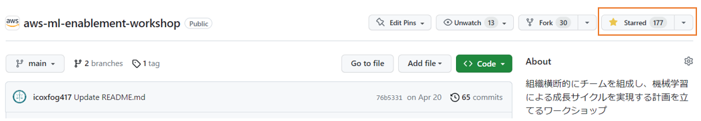
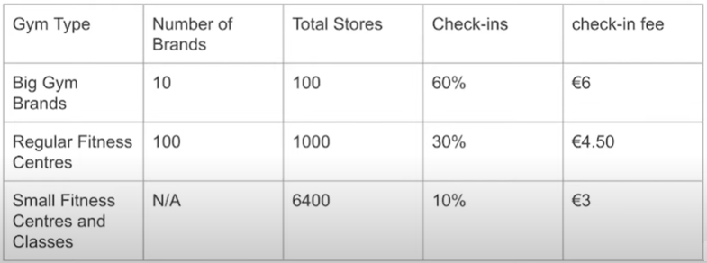
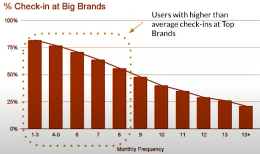

  
  <h2 align="center">
    データサイエンスを活用するプロダクトマネージャーを訪ねて
  </h2>

本記事では、機械学習やデータをプロダクトで活用するときの Q&A をまとめています。質問 (Q) の例としては、「機械学習を使った機能の発見から実装までどんな流れで進めればいいですか ? 」などです。回答 (A) は、 [Product School](https://www.youtube.com/@ProductSchoolSanFrancisco) で公開されている世界各国の著名なプロダクトマネージャーの方のプレゼンテーションやインタビューからまとめています。

海外のプロダクトマネージャーがどんな職歴や経歴なのか、あまり知られていないと思うので判別可能な限り LinkedIn のプロフィールへのリンクを載せています。なお、肩書は当時のものであり発言は会社を代表しているとは限らない点にご注意ください。

**新着 Q&A を見逃したくない方は[トップページ](https://github.com/aws-samples/aws-ml-enablement-workshop)で Star すればお気に入りから参照できます！**。Watch をすることで GitHub 上で通知を受け取ることもできます。特に有用な内容は [note のマガジン](https://note.com/piqcy/m/m045751fb954a) でもまとめています。

Q&A に誤りを見つけた方や Q&A の追加に関心ある方は末尾の Contribution をご参照ください。

## Q&A 一覧

* 機械学習を使った機能を実装するステップは ?
* プロダクトの種類によって、どのようにデータサイエンスの使い方が変わりますか ?
* プロダクトのフェーズによって、どのようにデータサイエンスの使い方が変わりますか ?
* プロダクトのどんなメトリクスを計測すればいいですか ?
* 計測したメトリクスからプロダクトの改善策を検討するプロセスは ?
* プロダクトマネージャーがデータを活用するときの注意点は ?
* データ分析チームはプロダクトチームにどのように関わるべきですか ?
* 顧客から信頼される AI 機能を作るために気を付けるべきことは ?
* 顧客から信頼される対話型 UI を作るために気を付けるべきことは ? 
* データサイエンティストの Job Description をどのように書けばいいですか ?
* データサイエンスのプロジェクトでもスクラム開発を適用できますか ?
* AI の登場で人間のプロダクトマネージャーは不要になりますか ?

## Q&A

### 機械学習を使った機能を実装するステップは ?

**Spotify の Product Leader [Derya Isler](https://www.linkedin.com/in/deryaisler/details/experience/) の場合**

ユーザーからの要望があったとき ( Mr.Children が好きなので似た曲を聞きたい、など ) 、次の図のように 1) プロダクトの実現したい体験に沿うか、 2) 成功を計測できるか、 3) より良い体験を創るのに必要なことか / スケールするか、 4) データはあるか/偏りはないか、 5) 求める精度を達成できるか、 6) ユーザーへどのように提供するか、の 6 つのステップで検討している。

([Webinar: Managing Machine Learning Products by Spotify Product Leader, Derya Isler](https://youtu.be/EhlHKhQv0Qg?t=1343) (2020) より引用)

### プロダクトの種類によって、どのようにデータサイエンスの使い方が変わりますか ?

**Uber の Product Lead [Tanvi Surti](https://www.linkedin.com/in/tanvisurti/) の場合**

プロダクトは Software 型のプロダクトと、 Marketplace 型のプロダクトに分けられる。 Uber は Marketplace のプロダクトであり、そこでは需要者と供給者のマッチングが肝になる。 Software 型ではクリック数やユーザー数などサービス上で計測可能な値を重視するが、 Marketplace では市場自体を成立させる需要者と供給者、それらを結び付けるアルゴリズムを重視する。だいたい 50% のデータサイエンス (ML) と、 50% の Ops (実行) で運営されている。

([What is Marketplace Product Management by Uber Product Manager](https://youtu.be/t4cnrwu465Q?t=2131) (2019) より)

### プロダクトのフェーズによって、どのようにデータサイエンスの使い方が変わりますか ?

**[The Lean Product Playbook](https://leanproductplaybook.com/) の著者 [Dan Olsen](https://www.linkedin.com/in/danolsen98/) の場合**

定量、定性の分析は Product Market Fit (PMF) とその先の成長に向けたフェーズの課題を解決するのに不可欠である。プロダクトのフェーズは PMF の前段階として 1) Before release, 2) After release, PMF した後として 3) After PMF の 3 段階に分けることができる。 3) に至るため PMF がまず目指すべき点であり、 PMF しているかどうかのシグナルは顧客の利用継続率を表す AARRR モデルで言うところの **Retention** から得られる (下図左)。 1) の段階では想定顧客の要求や感情など内面を知るための直接的なインタビューなどが有効であり、 2) の段階では 1) の定性的な手法に加え Release したプロダクトから定量的なデータを取るユーザーテストなどが有効になる (下図右)。 3) のフェーズでは定量的な分析が中心となり、顧客サーベイや A/B テストが主になる。

| AARRR モデル   | ログイン行動分析例 |
| ---- | ---- |
|    |    |

([Webinar: Actionable Advice for Integrating Quantitative and Qualitative Insights by Heap](https://youtu.be/ZYJij0RsQeg0) (2023) より引用)

### プロダクトのどんなメトリクスを計測すればいいですか ?

**[Twillio Segment](https://segment.com/) の Head of the Startup Program [Anand Deshpande](https://twitter.com/itgoesanandon) の場合**

プロダクトの成長はユーザーが 1) Acquire: どれだけ登録しているか、 2) Engage/Retain: どれだけ使ったか/どの程度の頻度で使うか、 3) どれだけ課金しているか、の 3 段階で計測できる。 Netflix でいえば、 1) Acquire: 会員登録、 2) Engage: 番組視聴 / 1 週間に何回視聴するか、 3) 有料プラン登録となる。とくに、ユーザーの利用頻度 (Retain) は Product Market Fit しているかどうかの重要な指標になる。 EC サイトであれば、ユーザーが週に何回買い物をするかなどである。頻度を計算する際の期間はプロダクトごとに異なり、 Airbnb のような旅行予約であれば年、 Facebook のような SNS であれば日次 / 月次となる。

([Webinar: Analytics & Stack Building for Startups by Segment Head of Startup Program, Anand Deshpande](https://youtu.be/rJiaMDgVnjM) (2022) より引用)

### 計測したメトリクスからプロダクトの改善策を検討するプロセスは ?

**[Glovo](https://glovoapp.com/) の Group Product Manager [Lokesh Mahajan](https://www.linkedin.com/in/lokesh-mahajan-6807543a/) の場合**

基本的な手順は 1) 数値分解 2) ボトルネック特定 3) 定量・定性両面でのユーザー体験の計測、 4) 問題の定義、 5) 問題解決を計測する KPI の定義、5) 解決策の実行、となる。  
提携したジムを月額固定額で利用できるサービスで、エリア拡大の原資を捻出するため利益を拡大する場合を題材にする。サービスの売上はユーザー数と課金額の積、コストはユーザー数・平均ジム利用回数・ 1 回あたりジムへ支払う手数料の積で計算できる。率直に課金額を増やすこと、またジムに通う回数や支払う額を減らそうとすることはユーザー体験の悪化に繋がってしまう。ただ、「ジムへ支払う手数料」について分析すると、 €6 を超える大手ジムの利用が 60% と高く ( 左図 ) 、サービスを利用するにつれ大手ジムの利用率は下がっていくことが分かったとする (右図) 。ここから、課題は初期ユーザーの獲得を手数料の高い大手のジムに依存していることと言える。アプリケーションに表示するジムのリストのうち大手事務の割合から定量的データ、ユーザーへのヒアリングから大手事務を利用する定性的データを取得できる。次に行うことは改善すべきメトリクスの定義だが、例えば N 回のジム利用で利用されたジムの数 ( 種類 )は良いメトリクスになりえる。アプリケーションのリストの表示の改善、ジムへの認証マーク付与といった施策により、大手ではなくとも信頼できる利便性の高いジムを提案することがこのメトリクスの改善につながる。

| 手数料の分析   | 大手ジム利用率の遷移 |
| ---- | ---- |
|    |    |

詳細は [プロダクトの課題をデータ分析から解決するための Step by Step](https://note.com/piqcy/n/n2d5e5c71a08e) をご参照。

([Webinar: Product Discovery With Data & User Research by Glovo Group PM, Lokesh Mahajan](https://youtu.be/tuo3CCfCHao) (2022) より引用)

### プロダクトマネージャーがデータを活用するときの注意点は ?

**Microsoft の Lead Product Manager [Ajanta Mahato](https://www.linkedin.com/in/ajanta-mahato-63b89b16/) の場合**

4 つ注意点がある。 1) 成功に直結する正しい指標を選ぶ、 2) 「あったらいい」指標に惑わされない、 3) 正しくテストを設計する、 4) 定量・定性両方のデータを使用する。1 は、ストレージサービスなら追加容量が購入された数や新規登録者数、 2 はサービス説明ビデオを見ていた時間などが該当 ( 購入数や登録者数の方が重要かつ十分 ) 、 3 は A/B テスト実施時のサンプルサイズなど、 4 は感情面の好き嫌いやプロダクトへの熱意なども重要なデータであると述べている。 

([Webinar: Data Is an Integral Part of Product Management by Microsoft Sr PM, Ajanta Mahato](https://youtu.be/2_HikZPPtb0) (2022) より引用)

### データ分析チームはプロダクトチームにどのように関わるべきですか ?

**Amplitude の Product Evangelist [Adam Greco](https://www.linkedin.com/in/adamgreco/), WillowTree の Director of Product Analysis [Jeremy Stern](https://www.linkedin.com/in/jeremy-stern-9a774611/) の場合**

データ分析チームの役割は、プロダクトを成長させるために答えるべきビジネス上の質問を定義・合意し、回答に必要なデータを収集するための実装を初期段階から開発チームに依頼するべき。データから得られたインサイトを積極的に共有することで仮説検証や問題解決のアクションに転換し、収益向上に貢献することで信頼を獲得することが必要。
データは収集しているがそこから回答できるビジネス上の質問の半分以上に経営層が関心がない、開発終盤でリソースがひっ迫しデータを収集するための SDK や JavaScript の実装が削除されたためにリリース後経営層に何も報告できない、あるいは Web と Mobile で別々の項目として収集され統合できない、といった状況に陥ってはならない。
データ分析チームが機能するには、マーケティングチームとプロダクト開発チームから突きつけられる異なる目標、異なるシステム的要求の調整に取り組まなければならないことがある。例えば、マーケティング側は集約されたダッシュボードを求める一方、プロダクト側は単一ユーザーの行動を細かく追跡できるセッションレコーディングを求めることがある。システム的要求として、マーケティング側は中央集権型の管理を好む一方、プロダクト側はセルフサービス型で自由に分析できる方式を好むことがある。いわゆる BI ツールはマーケティングの文脈で進化してきており、プロダクト側のメトリクス収集ツールはバグやパフォーマンスの問題点検知を目的に進化してきたため、 2 つのチームの要求を満たす単一のツールは現時点でそんなに簡単には見つからない。また、 2 つのチームからの異なる要求の背景には、 KPI の差があることもある。例えば、マーケティングは Lead の獲得、プロダクト開発チームは Conversion を KPI としているなど。この時、プロダクト開発チームはマーケティングの質の低い Lead にイライラすることになる。
答えるべき質問、取るべきデータ、マーケティング/プロダクトからの要求は刻々と変化するため、定期的に問い直す必要がある。

詳細は [プロダクトでのデータ活用を推進するために回避すべき 10 の罠](https://note.com/piqcy/n/n367e5fcf2fa7) をご参照。

[Webinar: Top 10 Digital Analytics Mistakes by Amplitude's Adam Greco and WillowTree's Jeremy Stern](https://youtu.be/6TImOjgju4s)

### 顧客から信頼される AI 機能を作るために気を付けるべきことは ? 

**KAYAK の Director of Global Mobile Monetization [Chris Butler](https://www.linkedin.com/in/chrisbu/) の場合**

機械学習は目標値を最大/最小化するよう学習するが、最適な体験は数値だけでなくプロトタイプを通じたメンタルモデルの観察から理解する必要がある。 AI のエラーは想像以上に不信感を生むため、合目的な利用と説明性が不可欠。

([#ProductCon NYC: How to Build Trustworthy AI Products by Philosophie Director of AI](https://www.youtube.com/watch?v=DIwyKwPzrjc) (2018) より)

### 顧客から信頼される対話型 UI を作るために気を付けるべきことは ? 

**Shopify の Senior Product Manager [Ellen Dunne](https://www.linkedin.com/in/ellendunne/) の場合**

対話型 UI 構築に際しては、単一目的に絞る、提案型にする、フィードバックを得るなど 7 つの構築指針が必要。 UI/UX として挨拶、わからない場合の回答方法など 5 つの構成要素を実装する必要があり、それが意図したとおり動いているか、計測するメトリクスが必要。詳細は [Shopify プロダクトマネージャーによる対話型UX構築のポイント](https://note.com/piqcy/n/n63f3f3dd9539) をご参照。

([The Future is Conversational by Shopify Sr. PM](https://www.youtube.com/watch?v=0epxFiYhBQA) (2018) より)

### データサイエンティストの Job Description をどのように書けばいいですか ?

**Airbnb の Director, Head of Data Science [Elena Tej Grewal](https://www.linkedin.com/in/elena-grewal/) の場合**

Airbnb では、データサイエンティストを Analytics 、 Inference 、 Algorithms の 3 つの職種に分けている。 Analytics はモニタリングするビジネスメトリクスを決めてダッシュボードの作成や可視化を通じビジネス状況を表すこと、 Inference は統計検定や因果推論によりデータから意思決定の支援を行うこと、 Altorithms は機械学習アルゴリズムを用いてデータから Airbnb のサービスやプロセスを改善することを主な役割とする。このように役割を分けた背景には、 2015 年から 2018 年にかけてある時はデータ分析、ある時は機械学習など異なるビジネスニーズに応じて採用を続けた結果、職掌の異なるデータサイエンティストが混在し何をなすべきか個々人が自信を持てなくなったことがある。そのため、会社にとってのデータサイエンスの価値を提議しそれぞれに専門的にコミットするロールを 3 つ提議した。現在 (2018年時点) では Analytics が 34% 、 Inference が 47% 、 Algorithms が 28% となっている。ただ、組織が小さい頃は分ける必要がないと思う。Airbnb では 2015 年の 30 人の段階では分けておらず、 2018 年に 100 人を超えてからロールを定義した。

([One Data Science Job Doesn’t Fit All](https://www.linkedin.com/pulse/one-data-science-job-doesnt-fit-all-elena-grewal/) (2018) より)

### データサイエンスのプロジェクトでもスクラム開発を適用できますか ?

**Amazon の Applied Scientist [Eugene Yan](https://www.linkedin.com/in/eugeneyan/) の場合**

Yes 。期間で区切り、優先順位をつけて有望な手法にベットしていくこと、デモを通じクライアントと成果を共有しながら進めることはデータサイエンスのプロジェクトでも有効である。あなたが機械学習を扱ったことがあるなら、データ分析とモデル構築は何度か往復するためソフトウェア開発のようにタスクの完了を積み上げていくことはできないと感じるかもしれない ( というか筆者自身そう感じていた )　。しかし、タイムボックスを区切るスクラムの手法は、限られた時間をモデル、データ、ハイパーパラメーターなど複数の選択肢のどれに割り当てるかという思考を要求する。この思考は予算が限られたプロジェクトで必要だし、頻繁なリリースとデモで顧客への説明責任を果たすことで納得感を醸成することができる。最初の 1 ~ 2 iteration は問題の特定に当て、 1 iteration ごと計画、デモ、振り返り、など固定で 3 ~ 4 時間は必要となる。

※日本でも KLab がこの方式で成果を出している : [モバイルゲーム会社の機械学習グループを立ち上げた話](https://qiita.com/hmkz/items/f7aa7f21e39cc8df1ce0)

([What I Love about Scrum for Data Science](https://eugeneyan.com/writing/what-i-love-about-scrum-for-data-science/) (2020) より)

### AI の登場で人間のプロダクトマネージャーは不要になりますか ?

**Amazon の Senior Product Manager [Siddharth Ilangovan](https://www.linkedin.com/in/sid-i/) の場合**

次のように Associate PM、PM、Senior PM、Product Lead の 4 段階で役割とスキルが定義でき、 PM が行う PRD 執筆やサーベイは AI への委譲が進む一方、 Senior や Product Leader が担う機会の発見やリーダーシップなどは人間力が必要。

|  PM の種別  | PM の役割 |
| ---- | ---- |
|    |    |

Associate PM はユーザーストーリーを課題や機能に落とし込むこと、 PM は新しい機能のリリース、 Senior PM は新しいプロダクトのリリース、 Product Leader は複数プロダクトのポートフォリオの実現に責任を持つイメージ。

([Webinar: Will AI Make Human Product Managers Obsolete? by Amazon Sr PM, Siddharth Ilangovan](https://youtu.be/7RmHV-XYM48?t=354) (2023) より)

## Contribution

* [Q&A の修正についてのご連絡はこちらから](https://github.com/aws-samples/aws-ml-enablement-workshop/issues)
* [Q&A の追加を頂ける場合こちらから (Pull Request)](
https://github.com/aws-samples/aws-ml-enablement-workshop/compare)
   * [Product School の動画](https://youtube.com/playlist?list=PLEXcbK4FvkxHhsqZGNfopt_jtTp10mXw3) を主にまとめています。未だ追加されていないものや、他に有用な動画や記事があればぜひ Pull Request を送って頂ければ幸いです。 Pull Request に不慣れなかたは [環境構築解説編](https://aws.amazon.com/jp/builders-flash/202207/git-introduction-for-data-schientist/?awsf.filter-name=*all)と [Pull Request 送付編](https://aws.amazon.com/jp/builders-flash/202209/git-introduction-for-data-schientist-2/?awsf.filter-name=*all) をご参照ください。
