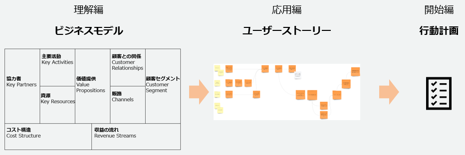
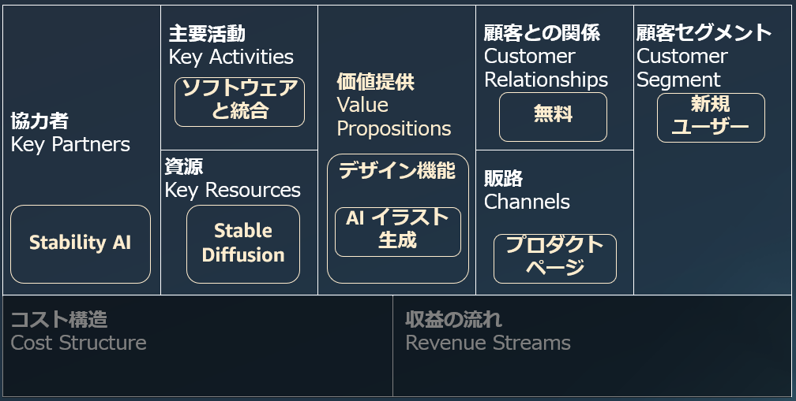
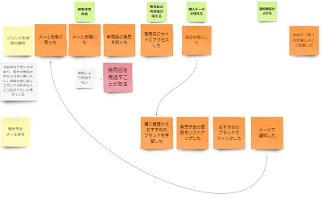

# ML Enablement Workshop のしおり (Day0)

## 目次

* ワークショップの概要
* ワークショップで期待する役割について
* AWSからできる支援について説明
* 質疑応答
* 開催日程確認
* [付録] ヒアリングシート

## ワークショップの概要

**ML Enablement Workshop のアウトプット**

ビジネスモデルの作成から始まり、ユーザーストーリーによる詳細化、行動計画への詳細化、と進みます。

## ワークショップで期待される役割について

MLEWでは以下の三つの職責が登場します。

* プロダクトマネージャー（以下PdM）
    * プロダクトのビジネス的な成功、そのためにロードマップを作成しどのような機能を開発するか方針を示し意思決定を行う職責の方をPdMと呼んでいます。
        * 参考: [プロダクトマネジメントのすべて 事業戦略・IT開発・UXデザイン・マーケティングからチーム・組織運営まで](https://www.amazon.co.jp/%E3%83%97%E3%83%AD%E3%83%80%E3%82%AF%E3%83%88%E3%83%9E%E3%83%8D%E3%82%B8%E3%83%A1%E3%83%B3%E3%83%88%E3%81%AE%E3%81%99%E3%81%B9%E3%81%A6-%E4%BA%8B%E6%A5%AD%E6%88%A6%E7%95%A5%E3%83%BBIT%E9%96%8B%E7%99%BA%E3%83%BBUX%E3%83%87%E3%82%B6%E3%82%A4%E3%83%B3%E3%83%BB%E3%83%9E%E3%83%BC%E3%82%B1%E3%83%86%E3%82%A3%E3%83%B3%E3%82%B0%E3%81%8B%E3%82%89%E3%83%81%E3%83%BC%E3%83%A0%E3%83%BB%E7%B5%84%E7%B9%94%E9%81%8B%E5%96%B6%E3%81%BE%E3%81%A7-%E5%8F%8A%E5%B7%9D-%E5%8D%93%E4%B9%9F/dp/4798166391/ref=d_pd_vtp_sccl_3_1/356-1302783-3087709?pd_rd_w=kMJMk&content-id=amzn1.sym.cbb45385-7b99-44b7-a528-bff5ddaa153d&pf_rd_p=cbb45385-7b99-44b7-a528-bff5ddaa153d&pf_rd_r=VNVE3FYZYAE1GYH2438T&pd_rd_wg=OvK72&pd_rd_r=829f808a-3dc8-49ff-8f8b-2affc105dce0&pd_rd_i=4798166391&psc=1)
    * プロダクトでの機械学習導入に当たってはできるかどうかの技術的な観点だけでなくビジネスモデルにとって不可欠かどうかの経営的観点が必要であり、後者の観点で適切なユースケースを選定いただくため参加いただきます。
* データサイエンティスト（以下DS）
    * 機械学習モデルの構築、またデータの分析を行う職責の方をデータサイエンティストとしています。
    * 機械学習のプロジェクトでは最終的に機械学習モデルを開発することになるため参加いただきます。
* 開発者
    * プロダクトの実装を行う職責を開発者と呼んでいます。アプリケーション、インフラエンジニアなどをまとめています。
    * ワークショップは機械学習による成長サイクルを実現するための実行可能な計画がアウトプットとなります。工数の規模感、MLを行うためのデータ等リソースについて知見を持つ方が計画作成に必要なため参加いただきます。

MLEWにおいてはすべての職責に使命が存在するため、どの役割が欠けてもワークショップが成り立ちません。例えばコンテンツの大きな項目となる、「理解」においては「DSによる事例紹介」から議論が始まりますし、「応用」については、「PdMによるペルソナの共有」から始まります。「開始」では実現可能な計画を立てるため、開発者によるMLを行うためのデータ等リソースの所在の開示や実装する場合の規模間の提示が不可欠です。

MLEWは**ワークショップの場だけでなく今後も連携を続け機械学習をプロダクトで活用するための最初のステップ**ですので、進行するのはお客様が主体となります。お互い異なる知識を持っているので、プロダクトマネージャーからしたらビジネスを知らない、データサイエンティストからすると機械学習を知らない、開発者からすると開発プロセスや現状のプロダクトの仕組みをしらない、と感じられ**イライラすることもあるかもしれません**。それらはチームを組成に向けた健全なプロセスなので、知らないこと、意見の相違は隠さず表明するよう努めてください(関心ある方は、「タックマンモデル」で検索してみたください)。

以下では、それぞれの職責に求められる役割について説明します。

### プロダクトマネージャー（PdM）がワークショップで行うこと

#### ワークショップ開始前

ヒアリングシートへの回答と、ワークショップの参加者・日程の調整をお願い致します。
※PdMは負荷の高い業務と認識しているので、日程調整などは適宜他の方に委譲していただければと思います。

- [ ] プロダクトの概要を棚卸する（[ヒアリングシート](#ヒアリングシート)を埋める）
- [ ] ワークショップ出席者を選定し、チームを組織する（1チーム6人目安）
    - [ ] データサイエンティスト
    - [ ] 開発者
    - [ ] 他、必要と判断した役職（例：カスタマーの声をより詳しく反映させるためにカスタマーサクセスチームに参加してもらう等）
- [ ] 事務処理（ここは必ずしもPdMがやらなくてもOK）
    - [ ] 日程の決定
    - [ ] 会場の決定
    - [ ] 設備の確認

#### Day1 [理解]

機械学習の講義終了後、データサイエンティストの方からプロダクトに応用可能そうな事例をいくつか紹介いただきます。1) 事例の中から適用可能性が高い事例の選択、 2) ビジネスモデルキャンバスを使った成功要因の分析、3) 自社版のビジネスモデルキャンバスの作成の順でワークショップを進めます。1 ~ 3 の進行を、プロダクトのビジネスリードとして牽引してください。他のメンバーは特に価値提供の右側の部分(顧客との関係、顧客セグメント、販路など)には明るくない可能性があるため、この点については丁寧に共有いただけると良いと思います。

- [ ] プロダクトの概要の共有
- [ ] ビジネスモデルキャンバスによる成功要因の分析
- [ ] 自社版のビジネスモデルキャンバスの作成

CanvaにおけるStability AIのStable Diffusion を使用したイラスト生成 AI 機能の実装、提供事例の分析例

#### Day2 [応用]

講義終了後、 1) Event Storming という手法を使用し Day1 で作成したビジネスモデルを「顧客セグメント」からたどる形で顧客体験を整理します。整理する中で、現実には観測されていない想像上の体験や発生するか不確実性が高い体験が出てくると思います。また、サービスを提供する上での技術的な課題も出てきます。2) 顧客体験を成立させるための課題を洗い出し、カテゴリごと、優先度順に整理します。Event Storming は初めて使用する手法と思いますので、進め方は AWS のファシリテーターよりご案内します。プロダクトマネージャーより、顧客に関する知識をもとに他チームメンバーに参加を促してください。

- [ ] チームメンバーのEventStormingへの参加を促す
- [ ] 顧客行動の整理・確認の主導
- [ ] 課題の整理・確認の主導
- [ ] 機械学習による解決プロセスの主導

Event Stormingの例。ペルソナを黄色のポストイット、時系列のイベントをオレンジ、課題を赤、が基本で他のポストイットや矢印は必要に応じ。

※Event StormingのうちBig Pictureと呼ばれるステップのみ行います。もしEvent Stormingの手法に関心がある場合は [Event Storming](https://www.eventstorming.com/) 発案者のサイトを参考してください。

#### Day3 [開始]

講義終了後、 Day2 で洗い出した課題を解決していく行動計画を策定いただきます。実現性がある計画を策定するため、開発者やデータサイエンティストより提示される見積もりやリソース、また最初から機械学習を使うことにこだわらずに基づき計画を立ててください。計画のフォーマットは会社ごと異なると思いますので、 AWS より指定のフォーマットはありません。計画立案後、最終的に本ワークショップへの参加を了承いただいたCxOなどへの説明日程をスケジュールしてください。

行動計画の作成がワークショップ終了 30 分前に完了していない場合、今後の連絡方法とCxOへの説明日程の決定を優先してください。ワークショップ終了後も連携し活動するためです。

- [ ] 機械学習の活用に向けた行動計画の作成
- [ ] 今後の連絡方法の確立
- [ ] CxOへの説明日程の決定

#### ワークショップ後

ワークショップ実施後も継続的に計画の実施が必要となります。PdMとして開発のリーダーシップをとっていただきます。計画が想定通りに進んでいるかなどの確認も行なっていきます。形式は自由ですが、定期的な会議の設定や、連絡用チャンネルの設定などを行うのが望ましいです。

- [ ] CxOへの計画説明
- [ ] 計画の進捗確認

### データサイエンティストがワークショップで行うこと

#### ワークショップ開始前

プロダクトに応用できる事例を2 - 6個あらかじめ収集いただき、Day1において説明いただきます。

- [ ] 自プロダクトドメインの事例の収集（背景を含めた説明ができることが望ましい）

事例をまとめるフォーマットに指定はありませんが、以下に Problem、Solution、Impactでまとめた例を示します。

#### Day1 [理解]

収集した事例を参加メンバーに共有してください。その際にデータサイエンティストは実現性、また機械学習の成長サイクルに入れるか(講義内で解説)を、自社の技術的背景や蓄積しているデータをもとに専門的な目線から意見を共有してください。機械学習については他のメンバーがほとんど知らない可能性があるので、知識量に応じ話してください。

- [ ] 収集した事例の展開
- [ ] 専門的な目線からの意見表明

#### Day2 [応用]

事例をもとに作成したビジネスモデルを、ユーザーストーリという細かいレベルに落とし込んでいきます。その際、機械学習の成長サイクルの実現に向け蓄積しておくべきデータ、推論の実現性や精度に特に注視し、意見表明を行なってください。

- [ ] 機械学習の成長サイクル実現に向けた知見の展開

#### Day3 [開始]

機械学習による課題解決にむけた行動計画を策定いただきます。データサイエンティストとして、機械学習モデルの構築・評価に至る前ステップとしてデータの収集や評価メトリクスが定義されているかなど、ビジネス価値を出すための前提条件が整うかを念頭にロードマップの策定に意見表明をして下さい。

- [ ] 機械学習モデル実装に至るまでのステップの妥当性
- [ ] 機械学習モデル実装の具体的なステップについての提案

#### ワークショップ後

 計画に則り、データ分析や機械学習モデルの実装を行なっていきます。この段階では具体的な実装が絡むため開発者と連携し、また連絡事項があればチームと連携しましょう

- [ ] データ分析や機械学習モデルの実装
- [ ] 定期的な進捗共有

### 開発者がワークショップで行うこと

#### ワークショップ開始前

現在自プロダクトで蓄積されているデータについて整理しておいてください。例えば顧客データ、だけではなく顧客のどのようなデータか（デモグラ情報、行動履歴、など）や、売上データ、などです。

#### Day1 [理解]

自プロダクトでどのように機械学習の成長サイクルを作成するか検討する際、プロダクトですでに保有している資源や利用している外部リソース(API等)について共有してください。

- [ ] プロダクトに蓄積されているデータ等の資源、利用している外部リソースの共有

#### Day2 [応用]

プロダクト開発者の観点から、顧客がプロダクトを使うときに発生するイベント、またプロダクト内で発生するイベントについて情報を提供し顧客体験の構築に貢献してください。

- [ ] 顧客の行動に伴いプロダクト内で発生するイベントの整理・確認の主導

#### Day3 [開始]

機械学習の活用に向け実現可能な計画を作るにあたり、プロダクトマネージャーやデータサイエンティストから提案されるアクションに対し概算の見積もりを提示してください。最初の計画として、1~3ヶ月の範囲で収まるように調整してください。

- [ ] 提示された行動に対する概算見積りの提示
- [ ] 開発チームのエンジニアリングリソースの状況の共有
- [ ] 実行計画作成の主導

#### ワークショップ後

計画に沿い、計画を実行します。1 ~ 3 ヶ月に収まらなかった課題については、プロダクトマネージャーに確認の上バックログなどに記載し将来取り組めるよう記録しておいてください。

- [ ] 実行計画作成の主導積み残した課題/タスクのバックログ

## AWSからできる支援

* 無償のサポート
    * アーキテクティング支援
        * アカウントチーム
    * 参考情報の提供
        * アカウントチームからの、ドキュメント、サンプルコード紹介
    * プロトタイプ開発支援
        * 大規模データ準備
        * MLOps
* 有償のサポート
    * AWS 機械学習コンピテンシーパートナー
        * https://aws.amazon.com/jp/machine-learning/partner-solutions/
    * ProServeによる実装支援

## 質疑応答

ワークショップの目的、職責の不明点などについて質問をください。
(AWSからも質問をさせていただきます)

## 開催日程確認

開催の日程、場所、使用するツール、特にホワイトボードのツールを確認します。
(※事後でも可)

## ヒアリングシート

- [ ] プロダクト名は何ですか？（例：Amazon Trip）
- [ ] プロダクト概要について教えてください
    - [ ] 想定顧客は誰ですか？（例：旅行をしたい人）
    - [ ] どのような課題を解決しますか？（例：旅行における交通手段や宿の情報が散在して、顧客が予定を立てるのに苦労をする）
    - [ ] メインとなる機能は何ですか？（例：交通手段や宿の情報を集約し、同一アプリから予約まで完了できる）
- [ ] プロダクトの開発・運用体制について教えてください（例：アプリ開発チームとMLチームがある。カスタマーサクセスチームがお客様の声を集約している　など）
- [ ] 開発メンバーはプロダクトのターゲットユーザや成長戦略について理解していますか？定期・非定期にそれらについてインプットしたり会話する機会はありますか？（組織図・体制図があれば）

