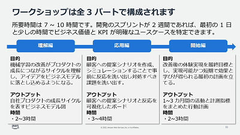
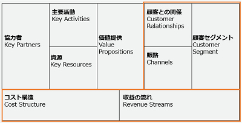
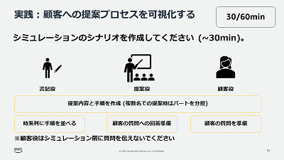
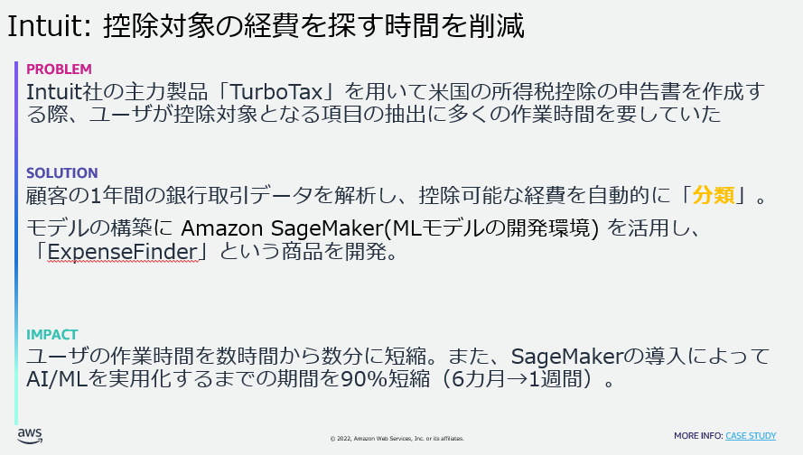

# ML Enablement Workshop のしおり (Day0)

## 目次

* ML Enablement Workshop とは
* ワークショップの参加者は誰か
* ワークショップで行うこと
   * プロダクトマネージャーがワークショップで行うこと
   * データサイエンティストがワークショップで行うこと
   * 開発者がワークショップで行うこと
* 必要な支援の確認
   * AWSからできる支援について説明
* 質疑応答
* 開催日程確認
* [付録] ヒアリングシート

## ML Enablement Workshop とは

ML Enablement Workshop は 3 部構成のプログラムです。

理解編ではビジネスモデル、応用編では価値提案のストーリー、開始編では AI/ML 機能を価値検証するための 1~3 カ月の計画をアウトプットします。

## ワークショップの参加者は誰か

MLEWでは以下の三つの職責が登場します。多義的な職責なので、 参加者の方が実際に行っている業務と、 MLEW で定義する職責とが一致しているかを確認してください。

* プロダクトマネージャー
    * プロダクトのビジネス的な成功、そのためにロードマップを作成しどのような機能を開発するか方針を示し意思決定を行う職責の方です。
        * 参考: [プロダクトマネジメントのすべて 事業戦略・IT開発・UXデザイン・マーケティングからチーム・組織運営まで](https://www.amazon.co.jp/%E3%83%97%E3%83%AD%E3%83%80%E3%82%AF%E3%83%88%E3%83%9E%E3%83%8D%E3%82%B8%E3%83%A1%E3%83%B3%E3%83%88%E3%81%AE%E3%81%99%E3%81%B9%E3%81%A6-%E4%BA%8B%E6%A5%AD%E6%88%A6%E7%95%A5%E3%83%BBIT%E9%96%8B%E7%99%BA%E3%83%BBUX%E3%83%87%E3%82%B6%E3%82%A4%E3%83%B3%E3%83%BB%E3%83%9E%E3%83%BC%E3%82%B1%E3%83%86%E3%82%A3%E3%83%B3%E3%82%B0%E3%81%8B%E3%82%89%E3%83%81%E3%83%BC%E3%83%A0%E3%83%BB%E7%B5%84%E7%B9%94%E9%81%8B%E5%96%B6%E3%81%BE%E3%81%A7-%E5%8F%8A%E5%B7%9D-%E5%8D%93%E4%B9%9F/dp/4798166391/ref=d_pd_vtp_sccl_3_1/356-1302783-3087709?pd_rd_w=kMJMk&content-id=amzn1.sym.cbb45385-7b99-44b7-a528-bff5ddaa153d&pf_rd_p=cbb45385-7b99-44b7-a528-bff5ddaa153d&pf_rd_r=VNVE3FYZYAE1GYH2438T&pd_rd_wg=OvK72&pd_rd_r=829f808a-3dc8-49ff-8f8b-2affc105dce0&pd_rd_i=4798166391&psc=1)
    * プロダクトでの機械学習導入に当たって、ユーザーの課題、ビジネスの課題の解決に直結しているか判断頂くために参加いただきます。
* データサイエンティスト
    * 機械学習モデルの構築、またデータの分析を行う職責の方をデータサイエンティストとしています。
    * 機械学習の専門家として、プロダクトで有用な用途や事例の提案、できること / できないことの判断等を頂くために参加いただきます。
* 開発者
    * プロダクトの実装を行う職責を開発者と呼んでいます。アプリケーション、インフラエンジニアなどを指します。
    * 実行可能な計画をアウトプットするため、スケジュールや見積りの妥当性を判断いただくために参加いただきます。

**MLEW にはすべての役割が必要です。** ビジネス価値を定義するにはプロダクトマネージャーが、 AI/ML また生成 AI による機能の実現性はデータサイエンティストが、既存のプロダクトへスケジュール通り組み込めるかは開発者の専門知識と経験が必要だからです ( 生成 AI の場合は開発者の方が兼任することもあります ) 。[機械学習プロジェクトの失敗確率は 8 割を超える](https://note.com/piqcy/n/n9c9e97896596) と言われており、その要因としてチームの連携不足は理由の 1 つに挙げられています。

**MLEW 終了後もチームとしての連携が続きます**。 MLEW が終わった後、「実はインパクトが低いと思っていた」「実はスケジュール的に無理だった」と後出しの意見で計画が変わってしまうことがしばしばあります。異なるロールの方と本音で議論するために、必要に応じ事前に会話・懇親の場を設けることをお勧めします。

ワークショップ実施者向けチェックリスト

- [ ] : MLEW に参加が必須である 3 つの職責の方が参加メンバーに含まれるか ?
   * 含まれない場合、該当の職責を持つ方にも参加いただくよう依頼してください。
   * 他、必要と判断した役職があれば加えてください（例：カスタマーサクセスチーム / UX デザイナーに参加してもらう等）。 1チーム 3 から 6 人程度が目安です。
- [ ] : MLEW で期待される職責が、聞いていた話と同じか ?
   * 異なる場合、参加をアサインした方 ( 主に経営層の方 ) と認識がずれている可能性があるため、ワークショップの目的と参加者について一度すり合わせの場を持たせてください。
- [ ] : MLEW 参加者は顔見知りか ?
   * 今回初めて顔を合わせる場合、お互いに意見が言いやすいよう Day0 中に自己紹介の時間を取ります。お客様には参加者同士がやり取りできる Slack 等の作成や、必要があれば追加の顔合わせの時間を取って頂ければ幸いです。
- [ ] : 事務処理
   - [ ] : 日程の決定
   - [ ] : 会場の決定
   - [ ] : 設備の確認

## ワークショップで行うこと

### プロダクトマネージャーがワークショップで行うこと

#### ワークショップ開始前

参加するチームメンバー１人１人に、ヒアリングシートへ回答するよう依頼してください。 Day0 の場で確認します。ヒアリングシートの項目は次の通りです。

- [ ] プロダクト名は何ですか？（例：Amazon Trip）
- [ ] プロダクト概要について教えてください
    - [ ] 想定顧客は誰ですか？（例：旅行をしたい人）
    - [ ] 顧客のどのような課題を解決しますか？（例：旅行における交通手段や宿の情報が散在して、顧客が予定を立てるのに苦労をする）
    - [ ] メインとなる機能は何ですか？（例：交通手段や宿の情報を集約し、同一アプリから予約まで完了できる）
    - [ ] メインとなる収益源は何ですか？（例：宿からの広告掲載料、取引成立時の手数料）
- [ ] プロダクトの開発・運用体制について教えてください（例：アプリ開発チームとMLチームがある。カスタマーサクセスチームがお客様の声を集約している　など）
- [ ] プロダクトのターゲットユーザや成長戦略について理解するための定期・非定期の場はありますか ? またそれは十分ですか ? 

このヒアリングシートの目的は、各メンバーのプロダクトに対する理解度に対してばらつきを確認することです。 Day0 で確認し、ばらつきが大きい場合は事前にプロダクトやロードマップについて説明する場の開催を検討してください。

MLEW で検討する課題について、定量的データや定性的なヒアリングで裏が取れている、また社内の議論で方向性が決められているほど参加者間の認識ずれを防いだり手戻りを避けることができます。開催前に MLEW で取り組むテーマについて合理的な必然性を説明できるよう準備をお願いいたします。

- [ ] : ヒアリングシートへの回答を依頼し、収集する
   - [ ] : 参加メンバー間で理解度に差がある場合、認識を一致させる場を設ける
- [ ] : MLEW で取り組む課題について裏付けや社内の妥当性が不十分な場合、参加メンバーに説明できるよう準備する

#### Day1 理解編

ワークショップとして、データサイエンティストの方に提示いただいた事例をもとに機械学習でプロダクトを成長させるためのビジネスモデルを作成します。ビジネスモデルキャンバスを使ったワークの主導をお願い致します。他のメンバーは特に価値提供の右側の部分(顧客との関係、顧客セグメント、販路など)には明るくない可能性があるため、この点については丁寧に共有いただけると良いと思います。詳細は[理解編の実施ガイド](./day1.md)を参照してください。

- [ ] : 自社のビジネスモデルをわかりやすく説明するための準備を頂く。
   * ビジネスモデルキャンバスの各要素をリストアップしておくなど。

#### Day2 応用編

理解編で作成したビジネスモデルを顧客へ提案するシナリオを作成し、提案に対する顧客の反応をロールプレイによりシミュレーションします。プロダクトのカスタマージャーニーマップやユーザーストーリーマッピングがあれば事前に共有頂くとスムーズです。当日もそちらをもとに顧客のペルソナや体験について他のメンバーに説明し、提案シナリオのインプットにしてください。詳細は[応用編の実施ガイド](./day2.md)を参照してください。

- [ ] : カスタマージャーニーマップやユーザーストーリーマッピングを事前に共有いただく。

#### Day3 開始編

Day3 では Day2 で洗い出した顧客の反応に基づきビジネスモデルの価値を検証する 1-3 カ月の計画を策定いただきます。実現性がある計画を策定するため、開発者やデータサイエンティストより提示される見積もりやリソースを参考に、また最初から機械学習を使うことにこだわらずに計画を立ててください。計画のフォーマットは会社ごと異なると思いますので、 AWS より指定のフォーマットはありません。計画立案後、最終的に本ワークショップへの参加を了承いただいたCxOなどへの説明日程をスケジュールしてください。詳細は[開始編の実施ガイド](./day3.md)を参照してください。

- [ ] 機械学習の活用に向けた行動計画の作成
- [ ] ワークショップ参加メンバー間での連絡方法、会議体の確立
- [ ] CxOへの説明日程の決定

#### ワークショップ後

ワークショップ実施後は、 Day3 の計画に沿い定期的な進捗の確認とマイルストンにおける CxO への説明を実施してください。

### データサイエンティストがワークショップで行うこと

#### ワークショップ開始前

プロダクトに応用できる事例を 2 - 6 個あらかじめ収集いただき、 Day1 で共有いただきます。なぜ自社プロダクトで有効と判断したのか、どのような手法なのか、どの程度のインパクトが見込めるかなど、事例をピックアップした背景もご準備をお願い致します。もし自社のビジネスやプロダクトの課題、あるいは競合他社の動向に知見がない場合はプロダクトマネージャーに事前に相談いただくと当日スムーズに議論できます。事例をまとめるフォーマットに指定はありませんが、以下に Problem、Solution、Impactでまとめた例を示します。

- [ ] 自プロダクトドメインの事例の収集（背景を含めた説明ができることが望ましい）
- [ ] (Optional) プロダクトマネージャーに、ビジネスやプロダクトの課題について事前にヒアリングし認識を合わせる
- [ ] (Optional) 競合他社やベンチマークとすべき目標企業の事例を確認しておく。

#### Day1 [理解編]

収集した事例を参加メンバーに共有してください。機械学習については他のメンバーがほとんど知らない可能性があるので、知識量に応じ話してください。ビジネスモデルの作成に当たっては、機械学習モデルの精度を高めるために資源としてどのようなデータを蓄積すべきか専門家の知見から意見を出してください。

- [ ] 収集した事例の共有
- [ ] 機械学習モデルの精度を継続的に高めるため蓄積すべきデータについて意見する

#### Day2 [応用編]

プロダクトマネージャーから顧客体験の情報としてカスタマージャーニーマップやユーザーストーリーマッピング等の資料が提供されます。これらをインプットし、機械学習モデルの用途について意見を出してください。

- [ ] 顧客体験の理解をもとにした機械学習モデルの用途について意見する

#### Day3 [開始編]

Day3 では Day2 で定義した顧客体験においてボトルネックとなる点を解決する　1-3 カ月の行動計画を策定いただきます。最終的なモデルの構築に向け、データの収集や評価メトリクスの定義といった将来に向けて必要なステップが含まれているか確認してください。

- [ ] 機械学習モデル実装に必要なステップに抜け漏れがないか確認する

#### ワークショップ後

ワークショップ実施後は、 Day3 の計画に沿い定期的な進捗の確認とマイルストン実現のための検証などをお願い致します。

### 開発者がワークショップで行うこと

#### ワークショップ開始前

機械学習のユースケースを検討するために、現在プロダクトに蓄積されているデータについて整理しておいてください。例えば顧客データ（デモグラフィック情報、行動履歴、など）や、売上データなどです。

- [ ] プロダクトに蓄積されているデータを整理する

#### Day1 [理解編]

ビジネスモデルの作成を行う際、すでに保有しているデータ ( 資源 ) や利用している外部リソース(API等) ( 協力者 ) について共有してください。

- [ ] プロダクトに蓄積されているデータ等の資源、利用している外部リソースの共有

#### Day2 [応用編]

プロダクト開発者の観点から、顧客が機械学習を用いた機能を利用する手順 ( ユーザーインターフェース ) について意見を出してください。

- [ ] 顧客のプロダクト操作手順に関する情報の提供、意見出し

#### Day3 [開始編]

Day3 では Day2 で定義した顧客体験においてボトルネックとなる点を解決する　1-3 カ月の行動計画を策定いただきます。プロダクトマネージャーやデータサイエンティストから提案されるアクションに対し概算の見積もりを提示し、最初の計画として、1-3ヶ月の範囲で収まるように調整してください。

- [ ] 提示された行動に対する概算見積りの提示
- [ ] 開発チームのエンジニアリングリソースの状況の共有
- [ ] 実行計画作成の主導

#### ワークショップ後

ワークショップ実施後は、 Day3 の計画に沿い定期的な進捗の確認とマイルストン実現のための検証などをお願い致します。計画に収まらなかったタスクについては、プロダクトマネージャーに確認の上バックログなどに記載し将来取り組めるよう記録しておいてください。

- [ ] 積み残した課題/タスクのバックログ登録

## 必要な支援の確認

参加者の方にワークショップを推進するにあたり、必要な事前インプットがないか確認します。

ワークショップ実施者向けチェックリスト

- [ ] プロダクトマネージャーの方はビジネスモデルの作成やカスタマージャーニーの作成の経験があるか ?
    * あまりない場合、プロダクトマネージャーとしてビジネスモデルの作成や顧客体験の可視化を主導できるように、下記の推薦図書で事前のインプットを行ってください。
    * [プロダクトマネジメントのすべて 事業戦略・IT開発・UXデザイン・マーケティングからチーム・組織運営まで](https://www.amazon.co.jp/%E3%83%97%E3%83%AD%E3%83%80%E3%82%AF%E3%83%88%E3%83%9E%E3%83%8D%E3%82%B8%E3%83%A1%E3%83%B3%E3%83%88%E3%81%AE%E3%81%99%E3%81%B9%E3%81%A6-%E4%BA%8B%E6%A5%AD%E6%88%A6%E7%95%A5%E3%83%BBIT%E9%96%8B%E7%99%BA%E3%83%BBUX%E3%83%87%E3%82%B6%E3%82%A4%E3%83%B3%E3%83%BB%E3%83%9E%E3%83%BC%E3%82%B1%E3%83%86%E3%82%A3%E3%83%B3%E3%82%B0%E3%81%8B%E3%82%89%E3%83%81%E3%83%BC%E3%83%A0%E3%83%BB%E7%B5%84%E7%B9%94%E9%81%8B%E5%96%B6%E3%81%BE%E3%81%A7-%E5%8F%8A%E5%B7%9D-%E5%8D%93%E4%B9%9F/dp/4798166391) : プロダクトマネジメントについて網羅的に紹介されている書籍です。Part1 / Part2 の箇所が目を通していただければ幸いです (書籍内ではビジネスモデルキャンバスに近いリーンキャンバスを使用しています) 。Part1: プロダクトの成功 (27 ページ)、Part2: プロダクトを育てる (131 ページ) まで読んでいただければ。
    * (Optional) [ビジネスモデルの教科書: 経営戦略を見る目と考える力を養う](https://www.amazon.co.jp/%E3%83%93%E3%82%B8%E3%83%8D%E3%82%B9%E3%83%A2%E3%83%87%E3%83%AB%E3%81%AE%E6%95%99%E7%A7%91%E6%9B%B8-%E7%B5%8C%E5%96%B6%E6%88%A6%E7%95%A5%E3%82%92%E8%A6%8B%E3%82%8B%E7%9B%AE%E3%81%A8%E8%80%83%E3%81%88%E3%82%8B%E5%8A%9B%E3%82%92%E9%A4%8A%E3%81%86-%E4%BB%8A%E6%9E%9D-%E6%98%8C%E5%AE%8F/dp/4492533435) : ビジネスモデルについて様々な事例を知りたい場合、副読書的に参照いただければと思います。
    * (Optional) [ジョブ理論 イノベーションを予測可能にする消費のメカニズム](https://www.amazon.co.jp/%E3%82%B8%E3%83%A7%E3%83%96%E7%90%86%E8%AB%96-%E3%82%A4%E3%83%8E%E3%83%99%E3%83%BC%E3%82%B7%E3%83%A7%E3%83%B3%E3%82%92%E4%BA%88%E6%B8%AC%E5%8F%AF%E8%83%BD%E3%81%AB%E3%81%99%E3%82%8B%E6%B6%88%E8%B2%BB%E3%81%AE%E3%83%A1%E3%82%AB%E3%83%8B%E3%82%BA%E3%83%A0-%E3%83%93%E3%82%B8%E3%83%8D%E3%82%B9%E3%83%AA%E3%83%BC%E3%83%80%E3%83%BC1%E4%B8%87%E4%BA%BA%E3%81%8C%E9%81%B8%E3%81%B6%E3%83%99%E3%82%B9%E3%83%88%E3%83%93%E3%82%B8%E3%83%8D%E3%82%B9%E6%9B%B8%E3%83%88%E3%83%83%E3%83%97%E3%83%9D%E3%82%A4%E3%83%B3%E3%83%88%E5%A4%A7%E8%B3%9E%E7%AC%AC2%E4%BD%8D-%E3%83%8F%E3%83%BC%E3%83%91%E3%83%BC%E3%82%B3%E3%83%AA%E3%83%B3%E3%82%BA%E3%83%BB%E3%83%8E%E3%83%B3%E3%83%95%E3%82%A3%E3%82%AF%E3%82%B7%E3%83%A7%E3%83%B3-%E3%82%AF%E3%83%AA%E3%82%B9%E3%83%86%E3%83%B3%E3%82%BB%E3%83%B3/dp/4596551227) / [ユーザーストーリーマッピング](https://www.amazon.co.jp/%E3%83%A6%E3%83%BC%E3%82%B6%E3%83%BC%E3%82%B9%E3%83%88%E3%83%BC%E3%83%AA%E3%83%BC%E3%83%9E%E3%83%83%E3%83%94%E3%83%B3%E3%82%B0-Jeff-Patton/dp/4873117321) : カスタマージャーニー / ユーザーストーリの作り方についてより詳しく知りたい場合、副読書的に参照いただければと思います。
- [ ] データサイエンティストの方にプロダクトの課題などについてインプットがされているか ?
  - インプットがない場合、プロダクトの課題に沿った事例を提案できるよう、プロダクトマネージャーにビジネスやプロダクトの課題を事前にヒアリングし認識を合わせておいてください。
  - また、競争優位なユースケースにあたりをつけるため、競合他社やベンチマークとすべき目標企業の事例を確認しておいてください。

### AWSからできる支援

* 無償のサポート
    * AWS 事例の紹介、実装のドキュメントやサンプルコードの紹介
    * 実装のアーキテクティング支援
    * モデル開発、モデルの運用プロセス (MLOps) の開発支援
    * 生成系 AI については無償の [Generative AI Innovation Center](https://aws.amazon.com/jp/about-aws/whats-new/2023/06/aws-announces-generative-ai-innovation-center/) をご案内できます。
* 有償のサポート
    * [AWS 機械学習コンピテンシーパートナーのご紹介](https://aws.amazon.com/jp/machine-learning/partner-solutions/)
    * コンサルティングチームによる要件定義・実装支援

## 質疑応答

ワークショップの目的、職責の不明点などについて質問をください。

## 開催日程確認

開催の日程、場所、使用するツール、特にホワイトボードのツールを確認します。
