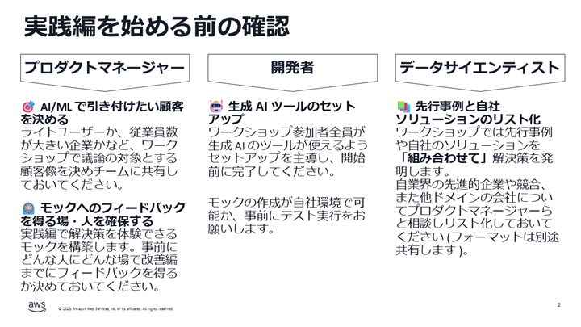

# ML Enablement Workshop Day0

## 目次

* ML Enablement Workshop のゴール
* ワークショップの開催条件
* ワークショップの参加者
* ワークショップの進め方
* 質疑応答
* Next Step
* 参考書籍

## ML Enablement Workshop のゴール

ワークショップのゴールは、 **生成 AI を含めた AI/ML 技術を、プロダクトの成長に繋げられるチームを組成することです**。そのために次の 4 つの目標の達成にチャレンジします。

1. AI/ML による成長に欠かせないメンバーを集めチームを組成する
2. Amazon 流の顧客起点のプロダクトづくりのプロセスである Working Backwards を自ら実践できるようになる
3. 生成 AI を活用することで意思決定に必要な情報を迅速に集め計画を修正する方法を習得する
4. チームが目指すゴールと到達状況の計測方法を決め、経営層への定期的な報告を開始する

AI/ML 特に生成 AI は進化の速い領域です。技術進化をプロダクトの成長につなげるには変更に柔軟であることが重要ですが、[日本の企業はスタートアップを含め変更に柔軟でない](https://note.com/piqcy/n/n66c93427d8f0)のが現状です。

 ML Enablement Workshop の v3 以降では、**生成 AI を活用したモックの作成からフィードバック獲得までワークショップ期間内に実践し、改善サイクルを一周回したうえでチーム開発に入れる** ことが最大の特徴となっています。これにより、ユースケースの妥当性向上はもちろん、変更機会を活かす経験を得たチームで開発を進めることができます。

* **実践編**で、 Amazon の顧客起点で考える Working Backwards の 5 つのプロセスを通しで行い、プロセスのアウトプット (プレスリリース) をもとに生成 AI でユーザー体験を得るための簡単なモックを構築します。時間は 3.5 時間程度で、参加人数によりある程度前後します
   * 実践編は文字通り「プロセスの実践」が目的で、質の高いアウトプットを得ることは目的ではありません
   * 「モック」は、ランディングページ、体験のための UI、クリック数等の反応をカウントする機能の最低 3 点を含むアプリケーションです。生成 AI を用い 10~30 分程度で構築する簡易なもので、改善編までにデータを収集するためだけに使用する使い捨てのアプリケーションです。
* **改善編**で、モックを使い得た定量・定性データをインプットに実践編で行ったプロセスを参加チームが自ら行い、アウトプットを改善します。その上で、今後のマイルストンを決めます。時間は 3 時間程度で、参加人数によりある程度前後します
   * マイルストンを立てる後半 1 時間が必須で、前半 2 時間をどのプロセスにどれくらい充てるかは参加チーム自身が計画し、実行します。これは、ワークショップ後のチーム開発の予行演習を兼ねています

ワークショップ終了後、進捗を定期的にスポンサーとなった経営層に報告しながら開発を進めて頂きます。これは、チームが組織横断で構成されている場合各組織の上長がチームを維持するためにチームの成果を知る必要があるためです。

## ワークショップの開催条件

ワークショップの開催条件は以下の 2 つです (AWS から提供する場合は追加条件があるため、担当にご確認ください ) 。これは、ゴールを達成するための前提条件でもあります。

1. AI/ML の取り組み及びワークショップ開催に経営層の支持がある
2. 「AI/ML による成長に欠かせないチームのメンバー」が集められる

## ワークショップの参加者

プロダクトマネージャー、開発者、データサイエンティストの参加を必須としています。生成 AI の場合、生成 AI の API やツール等の実用経験がある開発者がデータサイエンティストを兼任してもかまいません。

> [!TIP]
> ワークショップを実践された方からは、次の職責も参加すると効果的であるとフィードバックを頂いています。追加の参加者についても柔軟に検討ください。  
> ・営業・プリセールス  
> ・UX デザイナー  
> ・カスタマーサポート  
> 

主となる 3 役について ML Enablement Workshop が想定している職責の業務内容を説明します。会社により定義が異なっていることもあるので、参加者の方が実際に行っている業務と、本ワークショップでの定義が一致しているかを確認してください。

* プロダクトマネージャー
    * プロダクトのビジネス的な成功、そのためにロードマップを作成しどのような機能を開発するか方針を示し意思決定を行う権限がある職責の方です
        * 参考: [プロダクトマネジメントのすべて 事業戦略・IT開発・UXデザイン・マーケティングからチーム・組織運営まで](https://www.amazon.co.jp/%E3%83%97%E3%83%AD%E3%83%80%E3%82%AF%E3%83%88%E3%83%9E%E3%83%8D%E3%82%B8%E3%83%A1%E3%83%B3%E3%83%88%E3%81%AE%E3%81%99%E3%81%B9%E3%81%A6-%E4%BA%8B%E6%A5%AD%E6%88%A6%E7%95%A5%E3%83%BBIT%E9%96%8B%E7%99%BA%E3%83%BBUX%E3%83%87%E3%82%B6%E3%82%A4%E3%83%B3%E3%83%BB%E3%83%9E%E3%83%BC%E3%82%B1%E3%83%86%E3%82%A3%E3%83%B3%E3%82%B0%E3%81%8B%E3%82%89%E3%83%81%E3%83%BC%E3%83%A0%E3%83%BB%E7%B5%84%E7%B9%94%E9%81%8B%E5%96%B6%E3%81%BE%E3%81%A7-%E5%8F%8A%E5%B7%9D-%E5%8D%93%E4%B9%9F/dp/4798166391/ref=d_pd_vtp_sccl_3_1/356-1302783-3087709?pd_rd_w=kMJMk&content-id=amzn1.sym.cbb45385-7b99-44b7-a528-bff5ddaa153d&pf_rd_p=cbb45385-7b99-44b7-a528-bff5ddaa153d&pf_rd_r=VNVE3FYZYAE1GYH2438T&pd_rd_wg=OvK72&pd_rd_r=829f808a-3dc8-49ff-8f8b-2affc105dce0&pd_rd_i=4798166391&psc=1)
    * プロダクトでの機械学習導入が顧客とビジネスの課題双方を解決しているか判断頂くために参加いただきます
* 開発者
    * プロダクトの実装、また実現こうな開発スケジュールの立案を行う職責の方です
    * 技術的な実現性や開発スケジュールの制約などを判断頂くいただくために参加いただきます
* データサイエンティスト (生成 AI の場合開発者の兼任可)
    * 機械学習モデルの構築、またデータの分析を行う / 基盤モデルの仕組みと性能評価指標の意味を理解し、プロダクト開発に適切なモデルを選択する職責の方です
    * 機械学習 / 生成 AI の専門家として、プロダクトで有用な用途や事例、技術的な実現性を判断頂くために参加いただきます。

**ワークショップにはすべての役割が必要です。** 背景として、[機械学習プロジェクトの失敗確率は 8 割を超える](https://note.com/piqcy/n/n9c9e97896596) と言われており、その要因としてチームの連携不足は理由の 1 つに挙げられています。

**面識がない場合、事前の情報共有・懇親の場を設けることを推奨します**。ワークショップが表面的な会話になると、終わった後に「実はインパクトが低いと思っていた」「実はスケジュール的に無理だった」と後出しで計画が変わることがあります。異なる職責の方と本音で議論するため経営層を含め慣らしを終えた状態でワークショップに臨むことを推奨します。

ワークショップ実施者向けチェックリスト

- [ ] : 参加が必須である 3 つの職責の方が参加メンバーに含まれている
   * 含まれない場合、該当の職責を持つ方にも参加いただくよう依頼してください。会社によっては担当がいない場合や肩書の定義が異なることもあるため確認をお願いします。
   * 3 つの職責に加え参加いただいたほうが良い方がいたら声がけをお願いします（例：カスタマーサポート / UX デザイナーな等）
- [ ] : 参加者は顔見知りか ?
   * 今回初めて顔を合わせる場合、お互いに意見が言いやすいよう事前に自己紹介や懇親を行う場を設けることを推奨します。 
- [ ] : 実践編と改善編開催に向けた事務手続きをお願いします
   - [ ] : 日程の決定
   - [ ] : 会場の決定 ( オンライン / オフライン )
   - [ ] : 設備の確認 ( ホワイトボード / ペン / ポストイット )
   - [ ] : 参加者同士での連絡方法の確立 (Slack Channel など )

> [!TIP]
> ワークショップの開催は現地、オフラインを推奨しています。特に召集されたメンバーに日常的なコミュニケーションがない場合に強く推奨します。  

## ワークショップの進め方

ワークショップ前後を含めた進め方をこのセクションで説明します。

### Day0 : ワークショップ前

今、このドキュメントを読んでいるのは Day0 のフェーズです。 Day0 の後に「実践編」「改善編」の 2 パートを実施しワークショップは終了します。 Day0 は実際参加する方に **「なぜ集められたのか」「ワークショップでどのような役割が期待されているのか」** を事前に説明し合意を得ることが目的です。以後のパートでは時系列に沿い各職責が何を行うのかを説明します。

Day0 では、実践編に入る前に完了する必要がある事前ワークを依頼します。各職責の事前ワークは次の通りです。

* プロダクトマネージャー
   * 「どんなプロダクトのどんな顧客をターゲットにするか」を決めておくようお願いいたします。「顧客」は基本的にエンドユーザーを指します
   * 本ワークショップでは、実践編 / 改善編の間に実際にモックを触っていただきフィードバックを得ることが極めて重要になります。社内、もしくは社外のどんな人にどんなタイミングで触れてもらうか事前に依頼と準備をお願いします
* 開発者
   * 本ワークショップでは、**職責に関わらず生成 AI の利用を行います** 。そのため、参加者分の環境準備をお願いいたします。利用する生成 AI は Amazon Q Developer や Claude Code など開発が可能なツールです。
   * **参加者が生成 AI のツールを一度利用したこと ("おはよう" と入れて返答が返ってくることを確認等)、また実践編で行うモック構築が自社 AWS 環境で実現できることを事前に必ず確認ください。**
* データサイエンティスト/開発者
   * プロダクトマネージャーの定めた顧客の課題を解決する自社のプロダクトやソリューション、さらに参考にすべき先行事例についてリスト化しておいて頂くようお願いいたします。リストは、次に示すような Markdown 形式のファイルで、セクション名がソリューションタイトルで概要、技術的特徴、ビジネス的特徴などを含めてください

> \# ○○顧客のための解決策一覧  
> 
> \## ○○ソリューション  
> 概要: プログラミングの知識がなくても、ノーコードで業務システムや業務効率化のためのアプリケーションやツールが作れるクラウドサービス  
> 技術的特徴: エンドユーザーでも対話形式で生成 AI を用いてアプリケーションを生成しデプロイまで実行できる。ゼロから作成されるわけでなく、セキュリティやコスト抑制のため基盤となるフレームワークがありアプリケーション部分のみがルールに従い作成される  
> ビジネス的特徴: 個人・企業プランがありチャット回数に応じ課金される。月額固定分以上は従量課金で、サービス利用規約以外の使用が発覚した場合は通常料金の 5 倍の逆請求が発生する。 
>
> \## □□ソリューション

ワークショップ開始前のチェックリストは次の通りです。

- [ ] : ワークショップで扱うプロダクトと対象顧客が決まっている
- [ ] : 改善編までに誰から、いつフィードバックを得るか決まっている
- [ ] : 生成 AI のツールが参加者全員にセットアップされ、利用できることを確認した : [準備ガイド参照](/docs/organizer/generative_ai_setup.md)
- [ ] : 最低限開発者、データサイエンティストは生成 AI のツールを用い自社環境でモックが作成できることを確認した
- [ ] : 対象顧客の課題解決に関わる自社・先行事例のソリューションが Markdown 形式のファイルにまとめられている

### ワークショップ中 : 実践編

ワークショップの初日にあたる実践編では、 Amazon のプロダクト開発プロセス、 Working Backwards に沿いワークを進めます。主なアウトプットは、Refine で作成する解決策のプレスリリースです。

* プロダクトマネージャーの宿題は Listen 、データサイエンティストの宿題は Invent 、開発者の宿題は Define / Invent 、またモックの開発で使用します。

実践編の目的は「プロセスの実践」であるため、次の 3 点を意識してください。

1. **とりあえず決める**: 改善編が控えているので、実践編の意思決定は「とりあえず」で構いません。時間が来たらサイコロでもよいので決めましょう。
2. **知らない時は仮定する**: 改善編が控えているので十分な情報がない場合は仮定して先に進みましょう。仮定した情報は確認が必要なので、事実・実績の情報とは区別しましょう。
3. **出し惜しみせず取り組む** : 本ワークショップで決めた計画は定期的に経営層へ進捗を報告して頂きます。会社の期待がかかるプロジェクトに抜擢されたメンバーとして、知識・能力を振るってください。

Listen から Test/Iterate まで終わった後、次回改善編の説明をしている間に生成 AI にワークショップで作成したアウトプットをもとにモックを構築してもらいます。このモックを基に、次回改善編までに定量・定性のフィードバックを得ます。モックの作成が十分でない場合、開発者を中心に「体験できる」ところまでの仕上げを行ってください。

> [!IMPORTANT]
> 実践編完了後に構築するモックは、改善編までにフィードバックを得るために使う「使い捨て」のアプリケーションです。そのため、あまり作りこんだり凝ったことをしないよう注意してください。アプリケーションの入出力はダミーで構いませんし、デザインをきれいにする必要もありません。目安として、1 時間以上はかけるべきではありません。

実践編完了時点のチェックポイントは次の通りです。

- [ ] : Amazon の Working Backwards のプロセスを理解した
- [ ] : フィードバックを得られるモックができている
- [ ] : 改善編までにフィードバックを得る機会 (人・場所) が確保されている

### 実践編後・改善編前

次回改善編の当日までに、作成したモックを使い、事前に用意しておいたフィードバックを得る機会で定量・定性のフィードバックを獲得してください。フィードバックを改善編で共有できるよう、各チーム/サブチームごとにまとめておいてください。また、改善編にあたっては進行をチーム主体で行うため、進行担当者を決めておいてください。

- [ ] : モックに対するフィードバックが獲得できており、共有可能な形でまとめられている
- [ ] : 改善編の進行担当が決まっている

### ワークショップ中 : 改善編

ワークショップ最終日の改善編では、モックを通じ得られた結果を "Listen" する形で、 Working Backwards を今度はチーム主体で行って頂きます。なお、モックが全くウケていない、反応が薄いのはよくある話で、改善編の冒頭で各パートのブラッシュアップを行うポイントを簡単にインプットさせて頂きます。チーム主体での作業時間は 90 分程度になります。その間で、Working Backwards に沿いブラッシュアップされたプレスリリースを固めて頂きます。

後半 1 時間で今後のマイルストンを立て、ワークショップは終了となります。

改善編完了時点のチェックポイントは次の通りです。

- [ ] : ブラッシュアップされた解決策のプレスリリースがチームに共有されている
- [ ] : 解決策の評価指標が決まっている
- [ ] : 各自の Todo が明確になっている
- [ ] : ワークショップ終了後の定例進捗会議がスケジュールされている
- [ ] : 初回の経営層への報告日が決まりスケジュールされている
- [ ] : 作ったモックをすべて破棄した

作ったモックは基本的にすべて破棄してください。Vibe Coding で構築したアプリケーションは基本的に運用に堪えないので、フィードバック獲得目的であれば作り直し、本格的に作る価値があるなら設計を行ったうえで開発することを推奨します。生成 AI を活用し本番リリースに向けたソフトウェアを開発する手法に関心ある方は [AI DLC](https://aws.amazon.com/jp/blogs/news/ai-driven-development-life-cycle/) をご参照ください。

### ワークショップ後

ワークショップ後は、マイルストンの達成に向け決めた活動を実施します。活動を始めると情報がどんどんアップデートされるため、修正する必要があると感じたら改善編の要領で "Listen" に立ち戻り見直しが必要なプロセスを再度実施してください。

## 質疑応答

ワークショップの目的、職責の不明点などについて質問をください。

## Next Step

ワークショップ前の準備の開始をお願いします。

## 参考書籍

ワークショップを推進するにあたり、必要な事前インプットがないか確認します。インプットに有用な書籍やリソースを紹介します。

- [ ] プロダクトマネージャーの方はビジネスモデルの作成やカスタマージャーニーの作成の経験があるか ?
    * あまりない場合、プロダクトマネージャーとしてビジネスモデルの作成や顧客体験の可視化を主導できるように、下記の推薦図書で事前のインプットを行ってください。
    * [プロダクトマネジメントのすべて 事業戦略・IT開発・UXデザイン・マーケティングからチーム・組織運営まで](https://www.amazon.co.jp/%E3%83%97%E3%83%AD%E3%83%80%E3%82%AF%E3%83%88%E3%83%9E%E3%83%8D%E3%82%B8%E3%83%A1%E3%83%B3%E3%83%88%E3%81%AE%E3%81%99%E3%81%B9%E3%81%A6-%E4%BA%8B%E6%A5%AD%E6%88%A6%E7%95%A5%E3%83%BBIT%E9%96%8B%E7%99%BA%E3%83%BBUX%E3%83%87%E3%82%B6%E3%82%A4%E3%83%B3%E3%83%BB%E3%83%9E%E3%83%BC%E3%82%B1%E3%83%86%E3%82%A3%E3%83%B3%E3%82%B0%E3%81%8B%E3%82%89%E3%83%81%E3%83%BC%E3%83%A0%E3%83%BB%E7%B5%84%E7%B9%94%E9%81%8B%E5%96%B6%E3%81%BE%E3%81%A7-%E5%8F%8A%E5%B7%9D-%E5%8D%93%E4%B9%9F/dp/4798166391) : プロダクトマネジメントについて網羅的に紹介されている書籍です。Part1 / Part2 の箇所が目を通していただければ幸いです (書籍内ではビジネスモデルキャンバスに近いリーンキャンバスを使用しています) 。Part1: プロダクトの成功 (27 ページ)、Part2: プロダクトを育てる (131 ページ) まで読んでいただければ。
    * (Optional) [ビジネスモデルの教科書: 経営戦略を見る目と考える力を養う](https://www.amazon.co.jp/%E3%83%93%E3%82%B8%E3%83%8D%E3%82%B9%E3%83%A2%E3%83%87%E3%83%AB%E3%81%AE%E6%95%99%E7%A7%91%E6%9B%B8-%E7%B5%8C%E5%96%B6%E6%88%A6%E7%95%A5%E3%82%92%E8%A6%8B%E3%82%8B%E7%9B%AE%E3%81%A8%E8%80%83%E3%81%88%E3%82%8B%E5%8A%9B%E3%82%92%E9%A4%8A%E3%81%86-%E4%BB%8A%E6%9E%9D-%E6%98%8C%E5%AE%8F/dp/4492533435) : ビジネスモデルについて様々な事例を知りたい場合、副読書的に参照いただければと思います。
    * (Optional) [ジョブ理論 イノベーションを予測可能にする消費のメカニズム](https://www.amazon.co.jp/%E3%82%B8%E3%83%A7%E3%83%96%E7%90%86%E8%AB%96-%E3%82%A4%E3%83%8E%E3%83%99%E3%83%BC%E3%82%B7%E3%83%A7%E3%83%B3%E3%82%92%E4%BA%88%E6%B8%AC%E5%8F%AF%E8%83%BD%E3%81%AB%E3%81%99%E3%82%8B%E6%B6%88%E8%B2%BB%E3%81%AE%E3%83%A1%E3%82%AB%E3%83%8B%E3%82%BA%E3%83%A0-%E3%83%93%E3%82%B8%E3%83%8D%E3%82%B9%E3%83%AA%E3%83%BC%E3%83%80%E3%83%BC1%E4%B8%87%E4%BA%BA%E3%81%8C%E9%81%B8%E3%81%B6%E3%83%99%E3%82%B9%E3%83%88%E3%83%93%E3%82%B8%E3%83%8D%E3%82%B9%E6%9B%B8%E3%83%88%E3%83%83%E3%83%97%E3%83%9D%E3%82%A4%E3%83%B3%E3%83%88%E5%A4%A7%E8%B3%9E%E7%AC%AC2%E4%BD%8D-%E3%83%8F%E3%83%BC%E3%83%91%E3%83%BC%E3%82%B3%E3%83%AA%E3%83%B3%E3%82%BA%E3%83%BB%E3%83%8E%E3%83%B3%E3%83%95%E3%82%A3%E3%82%AF%E3%82%B7%E3%83%A7%E3%83%B3-%E3%82%AF%E3%83%AA%E3%82%B9%E3%83%86%E3%83%B3%E3%82%BB%E3%83%B3/dp/4596551227) / [ユーザーストーリーマッピング](https://www.amazon.co.jp/%E3%83%A6%E3%83%BC%E3%82%B6%E3%83%BC%E3%82%B9%E3%83%88%E3%83%BC%E3%83%AA%E3%83%BC%E3%83%9E%E3%83%83%E3%83%94%E3%83%B3%E3%82%B0-Jeff-Patton/dp/4873117321) : カスタマージャーニー / ユーザーストーリの作り方についてより詳しく知りたい場合、副読書的に参照いただければと思います。
い。
