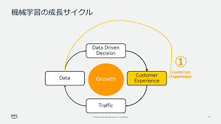
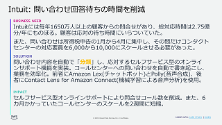
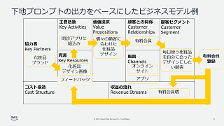

# ML Enablement Workshop : 理解編 (Day1)

## ワークショップ資料

PDF 資料 : [機械学習の成長サイクルを理解する](../presentations/ml-enablement-01-architect.pdf)

| 成長サイクルの理解 | 事例の共有 | ビジネスモデル作成 |
|:--------|:---------|:------|
|  |  | |

## 資料の構成と提供のポイント

1. 章前
   * ワークショップの冒頭で、経営層の方から参加者への期待を語って頂くとモチベーションを鼓舞するために効果的です。
1. 機械学習の成長サイクルを理解する
   * このセクションでは、機械学習の成長サイクルとそれを成立させる 3 つの要件について解説します。
   * 受講者の会社から発表されている決算説明資料等を参照し顧客の問題、ビジネスの問題についての仮説を提示するスライドを挿入することで、会社全体の方向性に沿った議論ができるよう誘導すると効果的です。
2. プロダクトで応用できそうな事例の共有
   * このセクションでは、データサイエンティストの方に事前に事例を集めてきていただいた内容を発表してもらいます。
   * バックアップとして、提供者側でも 1~2 個事例を用意しておくことが好ましいです。事例が的を外しているとワークショップの進行が難しくなります。
3. 自社版のビジネスモデルキャンバスの作成
   * このセクションでは事例をもとにしたユースケースの発案、ビジネスモデルキャンバスを使った成長サイクルの設計を行います。
   * ビジネスモデルで検証するユースケースは一つに絞る必要があります。その時適当に絞るのでなく、顧客は誰か、課題は何か、課題を示す定量的な数値はあるか、数値から優先度をつける場合どうなるか、など顧客起点、また改善すべきビジネス KPI 視点から合理的な絞り込みを行うよう促うと効果的です。

## 提供結果の確認とフォローアップ

* アンケートを取得してください。
* Day2 前に、カスタマージャーニーマップ / ユーザーストーリの共有を依頼する。
   * 事前に顧客の体験を提示いただき、 Day2 で議論するスコープについてあたりをつけておきます。プロダクトがカバーする業務フローが広い場合、 Day2 の時間内に議論が収まらない可能性があります。
* (Optional) ビジネスモデルキャンバスの内容を詰める時間を取る。
   * ビジネスモデルが不完全である場合、あるいは合意に至れていない場合プロダクトマネージャーと個別に時間を取り Day2 までに固めておきます。
* (Optional) 経営層へのレポートを行う。
   * プロダクトマネージャーと経営層のコミュニケーション頻度が低い場合、あるいは連携がうまく取れていない場合 Day1 終了後の段階でビジネスモデルの内容を共有する時間を取ってください。 Day2 、 Day3 と進んだ後にひっくり返されると提供者も受講者もつらい思いをすることになります。
