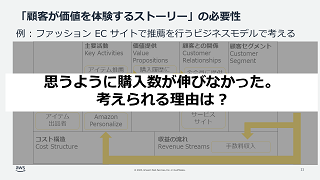
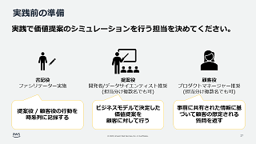
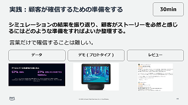

# ML Enablement Workshop 応用編 (Day2)

## ワークショップ資料

| ストーリー可視化の意義 | 顧客体験シミュレーション | 顧客の確信を得る準備 |
|:--------|:---------|:------|
|  |  | |

PDF 資料 : [顧客体験改善への応用](../presentations/ml-enablement-02-application.pdf)

## 資料の構成と提供のポイント

1. 章前
   * 理解編で作成したビジネスモデルの振り返りを行ってください。お客様自身に成長サイクルをどのように回すのか思い出し語って頂くと効果的です。
   * 理解編のビジネスモデルと似た事業を展開している競合他社の事例について、気に留めておくようインプットしてください。ただワークショップのフォーカスはあくまで顧客体験にあるため、競合との差別化戦略は議論しません。
2. 顧客が価値を体験するストーリーを可視化する必要性を知る
   * ストーリーの重要性を語るため、実体験に根付いた事例を話すとより理解を深めることができます ( 資料では私が実際書店に行って服の選び方の本を見つけた内容を題材にしています ) 。
   * ファシリテーターがカスタマージャーニーマップや競争戦略論などに明るくない場合、事前にインプットをしておくと説得力をもって話すことができます。
3. 実践 : 顧客の実体を可視化する
   * アイスブレークは必ず行ってください。
   * 実際に提案を持って行く具体的な顧客の名前を上げるようお願いしてください。
   * 開発者、データサイエンティストは顧客への説明に慣れていない場合があるので、提案役は 2 人にすると検討が進みやすいです。
   * お客様がポストイットに情報を書くペースが遅い場合、書記役が発言内容を書き留め進行を補佐してください。
4. 実践 : 顧客への提案プロセスを可視化する
   * 顧客役の手があきがちなので、提案に必要な顧客の情報を質問し引き出すよう提案役に促してください。
   * 2 人以上で行う場合、提案役と手順説明役でわけると行いやすいです。
   * シミュレーションを行う際、顧客役にはポストイットを書記役に渡してから質問するよう依頼してください。
   * 書記役は回答の内容をメモし、顧客役の質問の近くに貼ってください。後で上手く回答できていたかの評価に使用します。
5. 実践 : 顧客が確信するための準備をする
   * 顧客の課題に対する想像や、良く検討されていない回答についてデータを取得し確度を上げるのが第一のアクションになることが多いです。ヒアリングに当たっては手土産が必要なことがありますが、データ分析結果を提供する代わりにヒアリングさせて頂く立て付けにすると進めやすいです。
   * 1 カ月を超えるような準備が必要な物は分割できないか検討してください。

## 提供結果の確認とフォローアップ

* アンケートを取得してください。
* 次回の開始編までアクションを待つ必要はないので、積極的な行動を促してください。
* プロダクトマネージャーに、 応用編で構築した提案ストーリーを経営層や社内の他の関係者に話してみて追加のフィードバックを得るよう促してください。
* データサイエンティストには、データの分析に着手できるようであれば促してください。
