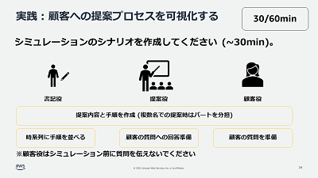
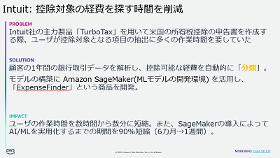

# ML Enablement Workshop のしおり (Day0)

## 目次

* ML Enablement Workshop とは
* ワークショップの参加者は誰か
* ワークショップで行うこと
   * プロダクトマネージャーがワークショップで行うこと
   * データサイエンティストがワークショップで行うこと
   * 開発者がワークショップで行うこと
* ワークショップ終了後行うこと
* 参考書籍
* 質疑応答
* Next Step

## ML Enablement Workshop とは

ML Enablement Workshop は 3 部構成のプログラムです。

理解編ではビジネスモデル、応用編では価値提案のストーリー、開始編では AI/ML 機能を価値検証するための 1~3 カ月の計画をアウトプットします。

## ワークショップの参加者は誰か

MLEWでは以下の三つの職責が登場します。会社により定義が異なっていることもあるので、参加者の方が実際に行っている業務と、 MLEW での定義が一致しているかを確認してください。

* プロダクトマネージャー
    * プロダクトのビジネス的な成功、そのためにロードマップを作成しどのような機能を開発するか方針を示し意思決定を行う職責の方です。
        * 参考: [プロダクトマネジメントのすべて 事業戦略・IT開発・UXデザイン・マーケティングからチーム・組織運営まで](https://www.amazon.co.jp/%E3%83%97%E3%83%AD%E3%83%80%E3%82%AF%E3%83%88%E3%83%9E%E3%83%8D%E3%82%B8%E3%83%A1%E3%83%B3%E3%83%88%E3%81%AE%E3%81%99%E3%81%B9%E3%81%A6-%E4%BA%8B%E6%A5%AD%E6%88%A6%E7%95%A5%E3%83%BBIT%E9%96%8B%E7%99%BA%E3%83%BBUX%E3%83%87%E3%82%B6%E3%82%A4%E3%83%B3%E3%83%BB%E3%83%9E%E3%83%BC%E3%82%B1%E3%83%86%E3%82%A3%E3%83%B3%E3%82%B0%E3%81%8B%E3%82%89%E3%83%81%E3%83%BC%E3%83%A0%E3%83%BB%E7%B5%84%E7%B9%94%E9%81%8B%E5%96%B6%E3%81%BE%E3%81%A7-%E5%8F%8A%E5%B7%9D-%E5%8D%93%E4%B9%9F/dp/4798166391/ref=d_pd_vtp_sccl_3_1/356-1302783-3087709?pd_rd_w=kMJMk&content-id=amzn1.sym.cbb45385-7b99-44b7-a528-bff5ddaa153d&pf_rd_p=cbb45385-7b99-44b7-a528-bff5ddaa153d&pf_rd_r=VNVE3FYZYAE1GYH2438T&pd_rd_wg=OvK72&pd_rd_r=829f808a-3dc8-49ff-8f8b-2affc105dce0&pd_rd_i=4798166391&psc=1)
    * プロダクトでの機械学習導入が顧客の課題、ビジネスの課題に直結しているか判断頂くために参加いただきます。
* データサイエンティスト
    * 機械学習モデルの構築、またデータの分析を行う。
    * 機械学習の専門家として、プロダクトで有用な用途や事例の提案、できること / できないことを判断頂くために参加いただきます。
* 開発者
    * プロダクトの開発スケジュールやチームのリソース状況を把握している方です。
    * 実行可能な計画をアウトプットするため、大まかな見積りや現在のスケジュールとの兼ね合いを判断いただくために参加いただきます。

**MLEW にはすべての役割が必要です。** [機械学習プロジェクトの失敗確率は 8 割を超える](https://note.com/piqcy/n/n9c9e97896596) と言われており、その要因としてチームの連携不足は理由の 1 つに挙げられています。

**MLEW 終了後もチームとしての連携が続きます**。ワークショップが表面的な会話になると、終わった後に「実はインパクトが低いと思っていた」「実はスケジュール的に無理だった」と後出しで計画が変わることがあります。異なるロールの方と本音で議論するために、必要に応じ事前に情報共有・懇親の場を設けることをお勧めします。

ワークショップ実施者向けチェックリスト

- [ ] : MLEW に参加が必須である 3 つの職責の方が参加メンバーに含まれるか ?
   * 含まれない場合、該当の職責を持つ方にも参加いただくよう依頼してください。会社によっては担当がいない場合や肩書の定義が異なることもあるため確認をお願いします。
   * 3 つの職責に加え参加いただいたほうが良い方がいたら声がけをお願いします（例：カスタマーサポート / UX デザイナーな等）
- [ ] : MLEW 参加者は顔見知りか ?
   * 今回初めて顔を合わせる場合、お互いに意見が言いやすいよう Day0 中に自己紹介の時間を取ります。お客様には参加者同士がやり取りできる Slack 等の作成や、必要があれば追加の顔合わせの時間を取って頂ければ幸いです。
- [ ] : Day1 、 Day2 、 Day3 の事務手続きをお願いします
   - [ ] : 日程の決定
   - [ ] : 会場の決定 ( オンライン / オフライン )
   - [ ] : 設備の確認 ( ホワイトボード / ペン / ポストイット )

※ MLEW ではオフラインを推奨しています。

## ワークショップで行うこと

### プロダクトマネージャーがワークショップで行うこと

#### ワークショップ開始前

参加するチームメンバー１人１人に、ヒアリングシートへ回答するよう依頼してください。 ヒアリングシートの項目は次の通りで、 Day0 で確認します。

- [ ] プロダクト名は何ですか？（例：Amazon Trip）
- [ ] プロダクト概要について教えてください
    - [ ] 想定顧客は誰ですか？（例：旅行をしたい人）
    - [ ] 顧客のどのような課題を解決しますか？（例：旅行における交通手段や宿の情報が散在して、顧客が予定を立てるのに苦労をする）
    - [ ] メインとなる機能は何ですか？（例：交通手段や宿の情報を集約し、同一アプリから予約まで完了できる）
    - [ ] メインとなる収益源は何ですか？（例：宿からの広告掲載料、取引成立時の手数料）
- [ ] プロダクトの開発・運用体制について教えてください（例：アプリ開発チームとMLチームがある。カスタマーサクセスチームがお客様の声を集約している　など）
- [ ] プロダクトのターゲットユーザや成長戦略について理解するための定期・非定期の場はありますか ? またそれは十分ですか ? 

このヒアリングシートの目的は、各メンバーのプロダクトに対する理解度のばらつきを確認することです。 Day0 で確認し、ばらつきが大きい場合は事前にプロダクトやロードマップについて説明する場の開催を検討してください。

MLEW で議論する機能の範囲や使う技術の範囲は、絞られているほど具体的な計画作成に時間が割けます。特にどんな顧客をターゲットにするのか、なぜそうするのか事前にスコープを決めておいてください。

- [ ] : ヒアリングシートへの回答を依頼し、収集する
   - [ ] : 参加メンバー間で理解度に差がある場合、認識を一致させる場を設ける
- [ ] : 今回検討している AI/ML を取り入れた機能のターゲットユーザーを決めて事前に参加者と共有する

#### Day1 理解編

顧客の課題、ビジネスの課題を基に解決策の評価基準を作成いただきます。どんな課題があり、重みがどのようについているのかチームメンバーに情報共有し、ユースケースの優先順位を示してください。

次回 Day2 では顧客の立場からビジネスモデルキャンバスが成立するか確認するので、現在の顧客体験を示す資料があれば事前に共有してください。

- [ ] : カスタマージャーニーマップやユーザーストーリーマッピングを事前に共有いただく。

#### Day2 応用編

ロールプレイを行う際、普段接している顧客の立場からユースケースについて批判的な反応を共有してください。ロールプレイの結果を受け、ユースケースの再選択を実施してください。

#### Day3 開始編

顧客への訪問などフィードバックを獲得する手段を提示し、必要なリソース ( デモや PPT 資料、アンケート送付の承認など ) がどの程度の期間で調整できるか他のロールの方に意見をもらってください。顧客からのフィードバックが得られる職責は参加者のうちプロダクトマネージャーのみなので、自身の行動を実行可能にするためにどんなリソースが必要なのかを共有することが重要です。

今後チームを連携していくため、ワークショップ内で以下の実施をお願いします。

- [ ] 機械学習の活用に向けた行動計画の作成
- [ ] ワークショップ参加メンバー間での連絡方法、会議体の確立
- [ ] CxOへの説明日程の決定

### データサイエンティストがワークショップで行うこと

#### ワークショップ開始前

プロダクトに応用できる事例を 2 - 6 個あらかじめ収集いただき、 Day1 で共有いただきます。なぜ自社プロダクトで有効と判断したのか、どのような手法なのか、どの程度のインパクトが見込めるかなど、事例をピックアップした背景もご準備をお願い致します。もし自社のビジネスやプロダクトの課題、あるいは競合他社の動向に知見がない場合はプロダクトマネージャーに事前に相談いただくと当日スムーズに議論できます。事例をまとめるフォーマットに指定はありませんが、以下に Problem、Solution、Impactでまとめた例を示します。

- [ ] 自プロダクトドメインの事例の収集（背景を含めた説明ができることが望ましい）
- [ ] プロダクトマネージャーに、ビジネスやプロダクトの課題について事前にヒアリングし認識を合わせる
- [ ] 競合他社やベンチマークとすべき目標企業の事例を確認しておく。

#### Day1 [理解編]

収集した事例を参加メンバーに共有してください。他の参加メンバーは機械学習になじみがない場合もあるので、相手の知識に合わせて説明をお願いします。議論では AI/ML/ 生成 AI の実現可能性を専門家の立場から判断ください。

#### Day2 [応用編]

ロールプレイで、提案役として顧客への提案シナリオの作成とプロダクトマネージャー演じる顧客への提案をお願いします ( 役割は当日決めますが提案役となることが多いです ) 。

#### Day3 [開始編]

実行計画を現実的にするため、技術的実現性や期間内に実装できるかを専門家の立場から判断ください。

### 開発者がワークショップで行うこと

#### ワークショップ開始前

機械学習のユースケースを検討するために、現在プロダクトに蓄積されているデータについて整理しておいてください。例えば顧客データ（デモグラフィック情報、行動履歴、など）や、売上データなどです。

- [ ] プロダクトに蓄積されているデータを整理する

#### Day1 [理解編]

ビジネスモデルの作成を行う際、すでに保有しているデータ ( 資源 ) や利用している外部リソース(API等) ( 協力者 ) について共有してください。

#### Day2 [応用編]

プロダクト開発者の観点から、顧客が機械学習を用いた機能を利用する手順 ( ユーザーインターフェース ) について意見を出してください。

#### Day3 [開始編]

実行計画を現実的にするため、開発スケジュールや実装の実現性を専門家の立場から判断ください。

### ワークショップ終了後行うこと

ワークショップ終了後、ワークショップで定義した実行計画に従い定期的な進捗確認のミーティングで状況を共有し 1~3 カ月以内に CXO への報告を完了してください。

開発リソースに課題があれば、 AWS のプロトタイピング支援の活用などの相談を開始してください。

#### AWSからできる支援

* AWS SA からのアーキテクティングやサンプルコードの紹介支援。
* プロトタイピングチームからのアプリケーション / ML 基盤構築支援
* [Generative AI Innovation Center](https://aws.amazon.com/jp/about-aws/whats-new/2023/06/aws-announces-generative-ai-innovation-center/) からの PoC 支援
* [AWS 機械学習コンピテンシーパートナーのご紹介](https://aws.amazon.com/jp/machine-learning/partner-solutions/)

## 参考書籍

ワークショップを推進するにあたり、必要な事前インプットがないか確認します。インプットに有用な書籍やリソースを紹介します。

- [ ] プロダクトマネージャーの方はビジネスモデルの作成やカスタマージャーニーの作成の経験があるか ?
    * あまりない場合、プロダクトマネージャーとしてビジネスモデルの作成や顧客体験の可視化を主導できるように、下記の推薦図書で事前のインプットを行ってください。
    * [プロダクトマネジメントのすべて 事業戦略・IT開発・UXデザイン・マーケティングからチーム・組織運営まで](https://www.amazon.co.jp/%E3%83%97%E3%83%AD%E3%83%80%E3%82%AF%E3%83%88%E3%83%9E%E3%83%8D%E3%82%B8%E3%83%A1%E3%83%B3%E3%83%88%E3%81%AE%E3%81%99%E3%81%B9%E3%81%A6-%E4%BA%8B%E6%A5%AD%E6%88%A6%E7%95%A5%E3%83%BBIT%E9%96%8B%E7%99%BA%E3%83%BBUX%E3%83%87%E3%82%B6%E3%82%A4%E3%83%B3%E3%83%BB%E3%83%9E%E3%83%BC%E3%82%B1%E3%83%86%E3%82%A3%E3%83%B3%E3%82%B0%E3%81%8B%E3%82%89%E3%83%81%E3%83%BC%E3%83%A0%E3%83%BB%E7%B5%84%E7%B9%94%E9%81%8B%E5%96%B6%E3%81%BE%E3%81%A7-%E5%8F%8A%E5%B7%9D-%E5%8D%93%E4%B9%9F/dp/4798166391) : プロダクトマネジメントについて網羅的に紹介されている書籍です。Part1 / Part2 の箇所が目を通していただければ幸いです (書籍内ではビジネスモデルキャンバスに近いリーンキャンバスを使用しています) 。Part1: プロダクトの成功 (27 ページ)、Part2: プロダクトを育てる (131 ページ) まで読んでいただければ。
    * (Optional) [ビジネスモデルの教科書: 経営戦略を見る目と考える力を養う](https://www.amazon.co.jp/%E3%83%93%E3%82%B8%E3%83%8D%E3%82%B9%E3%83%A2%E3%83%87%E3%83%AB%E3%81%AE%E6%95%99%E7%A7%91%E6%9B%B8-%E7%B5%8C%E5%96%B6%E6%88%A6%E7%95%A5%E3%82%92%E8%A6%8B%E3%82%8B%E7%9B%AE%E3%81%A8%E8%80%83%E3%81%88%E3%82%8B%E5%8A%9B%E3%82%92%E9%A4%8A%E3%81%86-%E4%BB%8A%E6%9E%9D-%E6%98%8C%E5%AE%8F/dp/4492533435) : ビジネスモデルについて様々な事例を知りたい場合、副読書的に参照いただければと思います。
    * (Optional) [ジョブ理論 イノベーションを予測可能にする消費のメカニズム](https://www.amazon.co.jp/%E3%82%B8%E3%83%A7%E3%83%96%E7%90%86%E8%AB%96-%E3%82%A4%E3%83%8E%E3%83%99%E3%83%BC%E3%82%B7%E3%83%A7%E3%83%B3%E3%82%92%E4%BA%88%E6%B8%AC%E5%8F%AF%E8%83%BD%E3%81%AB%E3%81%99%E3%82%8B%E6%B6%88%E8%B2%BB%E3%81%AE%E3%83%A1%E3%82%AB%E3%83%8B%E3%82%BA%E3%83%A0-%E3%83%93%E3%82%B8%E3%83%8D%E3%82%B9%E3%83%AA%E3%83%BC%E3%83%80%E3%83%BC1%E4%B8%87%E4%BA%BA%E3%81%8C%E9%81%B8%E3%81%B6%E3%83%99%E3%82%B9%E3%83%88%E3%83%93%E3%82%B8%E3%83%8D%E3%82%B9%E6%9B%B8%E3%83%88%E3%83%83%E3%83%97%E3%83%9D%E3%82%A4%E3%83%B3%E3%83%88%E5%A4%A7%E8%B3%9E%E7%AC%AC2%E4%BD%8D-%E3%83%8F%E3%83%BC%E3%83%91%E3%83%BC%E3%82%B3%E3%83%AA%E3%83%B3%E3%82%BA%E3%83%BB%E3%83%8E%E3%83%B3%E3%83%95%E3%82%A3%E3%82%AF%E3%82%B7%E3%83%A7%E3%83%B3-%E3%82%AF%E3%83%AA%E3%82%B9%E3%83%86%E3%83%B3%E3%82%BB%E3%83%B3/dp/4596551227) / [ユーザーストーリーマッピング](https://www.amazon.co.jp/%E3%83%A6%E3%83%BC%E3%82%B6%E3%83%BC%E3%82%B9%E3%83%88%E3%83%BC%E3%83%AA%E3%83%BC%E3%83%9E%E3%83%83%E3%83%94%E3%83%B3%E3%82%B0-Jeff-Patton/dp/4873117321) : カスタマージャーニー / ユーザーストーリの作り方についてより詳しく知りたい場合、副読書的に参照いただければと思います。
い。

## 質疑応答

ワークショップの目的、職責の不明点などについて質問をください。

## Next Step

開催の日程、場所、使用するツール、特にホワイトボードのツールを確認します。
